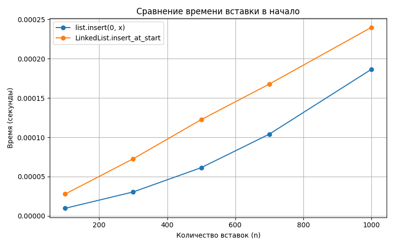
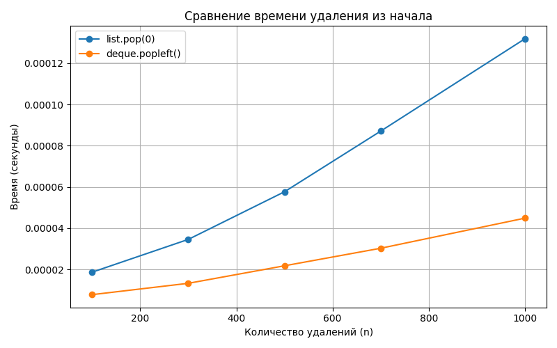

# Отчет по лабораторной работе №2
# Основные структуры данных: список, стек, очередь, дек

**Дата:** 2025-10-04  
**Семестр:** 3 курс, 2 полугодие (6 семестр)  
**Группа:** ПИЖ-23-1(2) 
**Дисциплина:** Анализ сложности алгоритмов  
**Студент:** Муртазов Руслан Равелевич 

## Цель работы
Изучить базовые структуры данных (список, стек, очередь, дек), их особенности и применение в Python. Научиться выбирать оптимальную структуру данных в зависимости от задачи, а также закрепить понимание принципов LIFO и FIFO.

## Теоретическая часть
- **List** — динамический массив в Python. Доступ по индексу — O(1), добавление в конец — O(1) амортизированно, вставка/удаление в начало или середину — O(n).  
- **Stack (стек)** — структура данных по принципу LIFO (Last In — First Out). Основные операции: `push` (добавить) и `pop` (удалить вершину).  
- **Queue (очередь)** — структура данных по принципу FIFO (First In — First Out). Основные операции: `enqueue` (добавить в конец), `dequeue` (удалить из начала).  
- **Deque (двусторонняя очередь)** — поддерживает добавление и удаление элементов с обеих сторон за O(1). В Python реализован через `collections.deque`.

## Практическая часть

### Выполненные задачи
- [x] Задача 1: Реализовать работу со списком (`list`) — добавление, удаление, доступ по индексу.  
- [x] Задача 2: Реализовать очередь на основе `deque` — операции добавления и удаления с обеих сторон.  
- [x] Задача 3: Реализовать стек на основе списка — операции `push` и `pop`.  

### Ключевые фрагменты кода
```python
from collections import deque

# List
my_list = [1, 2, 3]
my_list.append(4)
my_list.remove(2)
print("Элемент по индексу 1:", my_list[1])

# Deque
my_deque = deque([1, 2, 3])
my_deque.append(4)
my_deque.appendleft(0)
my_deque.pop()
my_deque.popleft()

# Stack
stack = []
stack.append("a")
stack.append("b")
stack.append("c")
print("Верхний элемент:", stack.pop())
```

## Результаты выполнения
Пример работы программы
```python
=== Вставка в начало ===
list.insert(0, x): 0.00020340000628493726
LinkedList.insert_at_start: 0.00027409999165683985

=== Удаление из начала ===
list.pop(0): 0.0001331999956164509
deque.popleft(): 5.080000846646726e-05
```

## Выводы
Графики наглядно демонстрируют фундаментальное различие между теоретической сложностью и практической производительностью в Python. При вставке в начало (list.insert(0, x) vs LinkedList.insert_at_start) ожидаемое преимущество связного списка не реализуется — наоборот, list оказывается быстрее. Это объясняется тем, что list реализован на C и оптимизирован для работы с памятью, тогда как пользовательская реализация LinkedList создаёт множество Python-объектов, что накладывает значительные расходы на интерпретатор. Однако при удалении из начала (list.pop(0) vs deque.popleft()) картина меняется: deque, спроектированный как двусторонняя очередь, действительно работает за O(1), и его преимущество чётко видно на графике — время растёт минимально, в то время как у list.pop(0) наблюдается линейный рост времени из-за сдвига элементов. Вывод: выбор структуры данных должен основываться не только на асимптотической сложности, но и на контексте языка и реализации — в Python встроенные типы часто быстрее пользовательских аналогов, даже если теоретически «должны быть медленнее».
## Ответы на контрольные вопросы:

**1. Что такое асимптотическая сложность алгоритма и зачем она нужна?**
Асимптотическая сложность — это способ оценки того, как изменяется время работы или потребление памяти алгоритмом при росте входных данных.
Она нужна для сравнения алгоритмов и выбора наиболее эффективного — чтобы понимать, какой алгоритм будет лучше работать на больших данных.

**2. Объясните разницу между O(1), O(n) и O(log n). Приведите примеры алгоритмов с такой сложностью.**

* **O(1)** — константное время, выполнение не зависит от размера входных данных.
  *Пример*: доступ к элементу массива по индексу.
* **O(n)** — линейное время, затраты растут пропорционально количеству элементов.
  *Пример*: линейный поиск в массиве.
* **O(log n)** — логарифмическое время, рост затрат медленнее, чем рост данных.
  *Пример*: бинарный поиск.

**3. В чем основное отличие линейного поиска от бинарного? Какие предварительные условия необходимы для выполнения бинарного поиска?**

* **Линейный поиск** проверяет элементы по очереди, начиная с первого — работает для любых массивов, сложность O(n).
* **Бинарный поиск** каждый раз делит массив пополам, выбирая, в какой половине искать — сложность O(log n).
  **Условие**: массив должен быть отсортирован.

**4. Почему на практике время выполнения алгоритма может отличаться от теоретической оценки O-большое?**
Потому что теоретическая оценка учитывает только порядок роста, но не учитывает:

* скорость процессора,
* оптимизацию компилятора или интерпретатора,
* особенности языка программирования,
* накладные расходы памяти.
  Поэтому два алгоритма с одинаковой асимптотикой могут работать с разной скоростью.

**5. Как экспериментально подтвердить, что сложность алгоритма равна O(n) или O(log n)? Опишите план эксперимента.**

1. Реализовать алгоритм.
2. Взять входные данные разного размера (например, массивы на 100, 1000, 10000 элементов).
3. Для каждого размера измерить время выполнения с помощью таймера (`time` или `timeit` в Python).
4. Построить график зависимости времени от размера входных данных.
5. Сравнить полученную кривую с эталонными функциями (линейной и логарифмической). Если график совпадает по форме, значит, эксперимент подтверждает оценку сложности.

## Приложения

