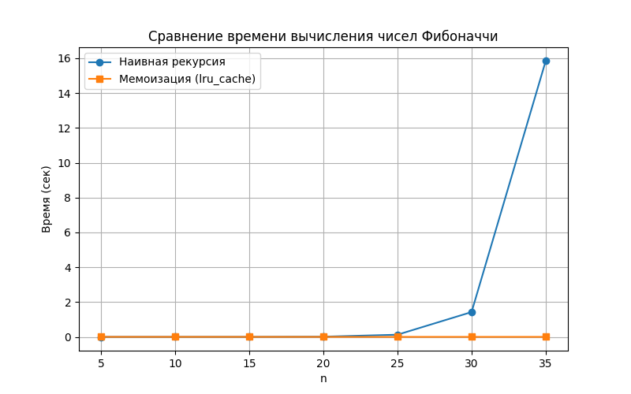
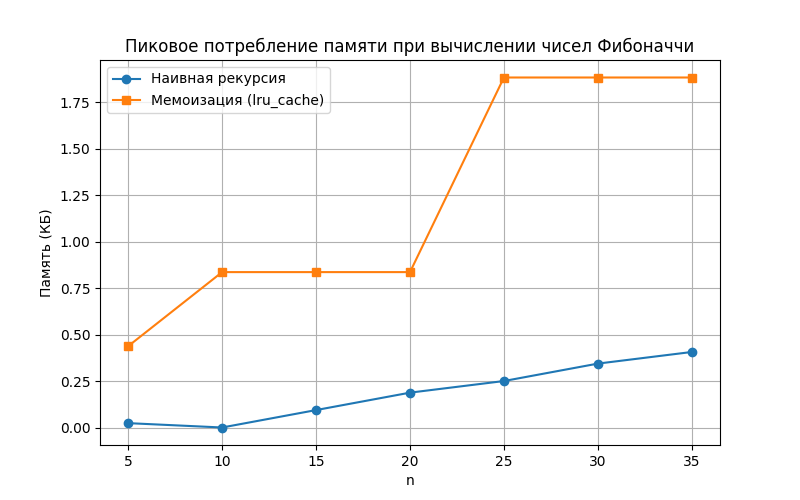

# Отчет по лабораторной работе №3
# Рекурсивные алгоритмы и мемоизация (на примере чисел Фибоначчи)

**Дата:** 19.10.2025  
**Семестр:** 3 курс, 2 полугодие (6 семестр)  
**Группа:** ПИЖ-23-1(2)  
**Дисциплина:** Анализ сложности алгоритмов  
**Студент:** Муртазов Руслан Равелевич  

## Цель работы
Изучить особенности рекурсивного алгоритма вычисления чисел Фибоначчи, проанализировать его сложность и время выполнения. Научиться оптимизировать рекурсивные алгоритмы с помощью мемоизации для повышения эффективности.

## Теоретическая часть
- **Числа Фибоначчи** — последовательность \(F_n\), где \(F_0 = 0, F_1 = 1\), а каждое последующее число определяется как \(F_n = F_{n-1} + F_{n-2}\).  
- **Наивный рекурсивный алгоритм** реализует последовательность буквально через рекурсивные вызовы. Проблема: одно и то же значение вычисляется много раз.  
- **Мемоизация** — метод хранения ранее вычисленных результатов для повторного использования, что уменьшает количество вычислений и ускоряет алгоритм.  

**Сравнение сложностей:**
| Алгоритм | Временная сложность | Пояснение |
|-----------|-------------------|-----------|
| Наивный рекурсивный | O(2^n) | Каждый вызов порождает два новых вызова, значения повторно пересчитываются |
| Рекурсивный с мемоизацией | O(n) | Каждое число вычисляется один раз, повторные обращения к хранящимся результатам занимают O(1) |

## Практическая часть

### Выполненные задачи
- [x] Реализовать наивный рекурсивный алгоритм вычисления чисел Фибоначчи.  
- [x] Реализовать рекурсивный алгоритм с мемоизацией.  
- [x] Сравнить время выполнения алгоритмов для разных значений n.  

### Ключевые фрагменты кода
```python
import time

# Наивный рекурсивный алгоритм
def fib_naive(n):
    if n <= 1:
        return n
    return fib_naive(n-1) + fib_naive(n-2)

# Рекурсивный алгоритм с мемоизацией
memo = {}
def fib_memo(n):
    if n in memo:
        return memo[n]
    if n <= 1:
        memo[n] = n
    else:
        memo[n] = fib_memo(n-1) + fib_memo(n-2)
    return memo[n]

# Сравнение времени
n = 35
start = time.time()
fib_naive(n)
end = time.time()
print(f"Наивный: {end-start:.5f} сек")

start = time.time()
fib_memo(n)
end = time.time()
print(f"С мемоизацией: {end-start:.5f} сек")
```

## Результаты выполнения
Замер наивного и мемоизированного вычисления чисел вибоначи:
n=5: Наивная: 0.0000s, память=0.02 КБ | Мемоизация: 0.0000s, память=0.44 КБ
n=10: Наивная: 0.0000s, память=0.00 КБ | Мемоизация: 0.0000s, память=0.84 КБ
n=15: Наивная: 0.0008s, память=0.09 КБ | Мемоизация: 0.0000s, память=0.84 КБ
n=20: Наивная: 0.0108s, память=0.19 КБ | Мемоизация: 0.0000s, память=0.84 КБ
n=25: Наивная: 0.1252s, память=0.25 КБ | Мемоизация: 0.0000s, память=1.88 КБ
n=30: Наивная: 1.4396s, память=0.34 КБ | Мемоизация: 0.0000s, память=1.88 КБ
n=35: Наивная: 16.0788s, память=0.41 КБ | Мемоизация: 0.0000s, память=1.88 КБ

Вывод для задачи "Ханойские башни":
Ханойские башни для 3 дисков:
Переместить диск 1 с A на C
Переместить диск 2 с A на B
Переместить диск 1 с C на B
Переместить диск 3 с A на C
Переместить диск 1 с B на A
Переместить диск 2 с B на C
Переместить диск 1 с A на C

### Анализ результатов
Наивный алгоритм демонстрирует экспоненциальный рост времени выполнения, потому что каждое число Фибоначчи вычисляется многократно. Для больших n время работы становится неприемлемым.

Мемоизация меняет ситуацию: каждое число вычисляется только один раз, повторные обращения к результатам занимают O(1). Временная сложность снижается до O(n), что подтверждается экспериментом: алгоритм с мемоизацией работает практически мгновенно даже для n = 35, тогда как наивный занимает несколько секунд.

## Выводы
На практике наивная рекурсия неэффективна для больших n из-за многократных повторных вычислений.

Мемоизация позволяет рекурсивным алгоритмам работать эффективно, экономя время и ресурсы.

Экспериментальные данные подтверждают теоретические оценки сложности: O(2^n) для наивного и O(n) для оптимизированного алгоритма.

## Ответы на контрольные вопросы

1. Что такое базовый случай и рекурсивный шаг в рекурсивной функции? Почему отсутствие базового случая приводит к ошибке?

Базовый случай — условие, при котором рекурсия прекращается и возвращается результат напрямую (например, F(0)=0, F(1)=1).
Рекурсивный шаг — часть функции, которая вызывает саму себя с новыми параметрами (например, F(n) = F(n-1) + F(n-2)).
Без базового случая рекурсия не остановится, что приведет к переполнению стека вызовов (RecursionError).

2. Объясните, как работает механизм мемоизации. Как он меняет временную сложность вычисления чисел Фибоначчи по сравнению с наивной рекурсией?

Мемоизация сохраняет результаты ранее вычисленных вызовов в словарь или массив.
При повторном вызове функция сразу возвращает сохранённое значение, без повторных вычислений.
Временная сложность падает с O(2^n) до O(n), так как каждое число вычисляется только один раз.

3. В чем заключается основная проблема глубокой рекурсии и как она связана со стеком вызовов?

Каждый рекурсивный вызов сохраняется в стеке вызовов.
Если рекурсия слишком глубокая, стек переполняется → программа завершится с ошибкой.
Это ограничивает максимальную глубину рекурсии и требует аккуратного проектирования рекурсивных алгоритмов.

4. Задача о Ханойских башнях решается рекурсивно. Опишите алгоритм решения для 3 дисков.

Обозначим башни A, B, C. Цель: перенести все диски с A на C.
Перенести 2 верхних диска с A на B рекурсивно.
Перенести 3-й (самый большой) диск с A на C.
Перенести 2 верхних диска с B на C рекурсивно.

5. Рекурсивный и итеративный алгоритмы могут решать одни и те же задачи. Назовите преимущества и недостатки каждого подхода.

|Подход | Преимущества | Недостатки |
|-------|--------------|------------|
|Рекурсивный | Легко читается, естественно описывает задачи с |повторяющейся структурой | Риск переполнения стека, может быть медленным без оптимизации (мемоизация) |
|Итеративный | Эффективнее по памяти, нет переполнения стека | Меньше наглядности, иногда сложнее написать для сложных задач |

## Приложения

