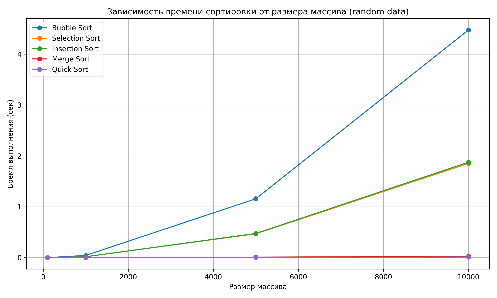
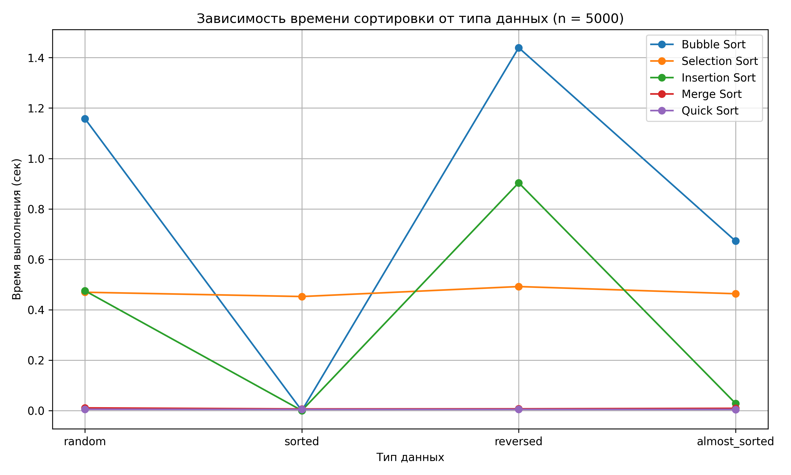

# Отчет по лабораторной работе №4
# Алгоритмы сортировки

**Дата:** 19.10.2025  
**Семестр:** 3 курс, 1 полугодие (5 семестр)  
**Группа:** ПИЖ-23-1(2)  
**Дисциплина:** Анализ сложности алгоритмов  
**Студент:** Муртазов Руслан Равелевич  

## Цель работы
Изучить и реализовать основные алгоритмы сортировки. Провести их теоретический и практический сравнительный анализ по временной и пространственной сложности. Исследовать влияние начальной упорядоченности данных на эффективность алгоритмов. Получить навыки эмпирического анализа производительности алгоритмов.

## Теоретическая часть
- **Сортировка пузырьком (Bubble Sort)**: Многократно проходит по массиву, сравнивая и меняя местами соседние элементы. Сложность: O(n²) во всех случаях.
- **Сортировка выбором (Selection Sort)**: На каждом проходе находит минимальный элемент из неотсортированной части и ставит его на очередную позицию. Сложность: O(n²).
- **Сортировка вставками (Insertion Sort)**: Построение окончательного массива путем пошагового вставления каждого элемента в правильную позицию в уже отсортированной части. Сложность: O(n²) в худшем и среднем, O(n) в лучшем (уже отсортированный массив).
- **Сортировка слиянием (Merge Sort)**: Рекурсивный алгоритм "разделяй и властвуй". Массив разбивается на две части, которые сортируются рекурсивно, а затем сливаются в один отсортированный массив. Сложность: O(n log n) во всех случаях. Требует O(n) дополнительной памяти.
- **Быстрая сортировка (Quick Sort)**: Рекурсивный алгоритм "разделяй и властвуй". Выбирается опорный элемент, массив разделяется на элементы меньше и больше опорного, которые сортируются рекурсивно. Сложность: O(n log n) в среднем, O(n²) в худшем случае (плохой выбор опорного элемента). Сортировка на месте, не требует дополнительной памяти.

## Практическая часть

### Выполненные задачи
1. Реализовать 5 алгоритмов сортировки.
2. Провести теоретический анализ сложности каждого алгоритма.
3. Экспериментально сравнить время выполнения алгоритмов на различных наборах данных.
4. Проанализировать влияние начальной упорядоченности данных на эффективность сортировок.  

### Ключевые фрагменты кода
```python
"""
Реализации пяти алгоритмов сортировки:
- bubble_sort
- selection_sort
- insertion_sort
- merge_sort
- quick_sort

Каждая функция сортирует копию входного списка и возвращает её.
Докстринги включают временную и пространственную сложность.
"""

from typing import List, Sequence


def sorted_copy(arr: Sequence[int]) -> List[int]:
    """Возвращает копию списка для сортировки (не мутирует вход)."""
    return list(arr)


def is_sorted(arr: Sequence[int]) -> bool:
    """Проверяет, отсортирован ли массив по неубыванию."""
    return all(arr[i] <= arr[i + 1] for i in range(len(arr) - 1))


# ----------------------
# 1. Bubble Sort
# ----------------------
def bubble_sort(arr: Sequence[int]) -> List[int]:
    """
    Пузырьковая сортировка (in-place, но возвращаем копию).

    Временная сложность:
      - Лучший: O(n) (если оптимизировать и не делать проходы,
      когда нет обменов).
      - Средний: O(n^2).
      - Худший: O(n^2).

    Пространственная сложность:
      - O(1) дополнительной памяти (in-place).
    """
    a = sorted_copy(arr)
    n = len(a)
    # Внешний цикл: O(n)
    for i in range(n):
        swapped = False
        # Внутренний цикл: O(n - i)
        for j in range(0, n - i - 1):
            # Сравнение соседних элементов: O(1)
            if a[j] > a[j + 1]:
                # Обмен элементов: O(1)
                a[j], a[j + 1] = a[j + 1], a[j]
                swapped = True
        if not swapped:
            break
    return a


# ----------------------
# 2. Selection Sort
# ----------------------
def selection_sort(arr: Sequence[int]) -> List[int]:
    """
    Сортировка выбором.

    Временная сложность:
      - Лучший: O(n^2).
      - Средний: O(n^2).
      - Худший: O(n^2).

    Пространственная сложность:
      - O(1) дополнительной памяти (in-place).
    """
    a = sorted_copy(arr)
    n = len(a)
    # Проходим по всем позициям i: O(n)
    for i in range(n):
        min_idx = i
        for j in range(i + 1, n):
            if a[j] < a[min_idx]:
                min_idx = j
        if min_idx != i:
            a[i], a[min_idx] = a[min_idx], a[i]
    return a


# ----------------------
# 3. Insertion Sort
# ----------------------
def insertion_sort(arr: Sequence[int]) -> List[int]:
    """
    Сортировка вставками.

    Временная сложность:
      - Лучший: O(n) (если массив уже отсортирован).
      - Средний: O(n^2).
      - Худший: O(n^2).

    Пространственная сложность:
      - O(1) дополнительной памяти (in-place).
    """
    a = sorted_copy(arr)
    n = len(a)
    # i от 1 до n-1: O(n)
    for i in range(1, n):
        key = a[i]  # O(1)
        j = i - 1
        # Сдвигаем элементы больше key вправо: O(k) где k — число сдвигов
        while j >= 0 and a[j] > key:
            a[j + 1] = a[j]
            j -= 1
        a[j + 1] = key
    return a


# ----------------------
# 4. Merge Sort
# ----------------------
def merge(left: List[int], right: List[int]) -> List[int]:
    """Слить два отсортированных списка в один."""
    i = j = 0
    merged: List[int] = []
    # Слияние: O(len(left) + len(right))
    while i < len(left) and j < len(right):
        if left[i] <= right[j]:
            merged.append(left[i])
            i += 1
        else:
            merged.append(right[j])
            j += 1
    # Добавляем остатки: O(remaining)
    if i < len(left):
        merged.extend(left[i:])
    if j < len(right):
        merged.extend(right[j:])
    return merged


def merge_sort(arr: Sequence[int]) -> List[int]:
    """
    Сортировка слиянием (рекурсивная).

    Временная сложность:
      - Лучший: O(n log n).
      - Средний: O(n log n).
      - Худший: O(n log n).

    Пространственная сложность:
      - O(n) дополнительной памяти для слияния.
    """
    a = list(arr)
    n = len(a)
    if n <= 1:
        return a
    mid = n // 2
    left = merge_sort(a[:mid])
    right = merge_sort(a[mid:])
    return merge(left, right)


# ----------------------
# 5. Quick Sort
# ----------------------
def quick_sort(arr: Sequence[int]) -> List[int]:
    """
    Быстрая сортировка (рекурсивная, на месте в идеале, здесь —
    функциональная версия).

    Временная сложность:
      - Лучший: O(n log n).
      - Средний: O(n log n).
      - Худший: O(n^2) (например, при уже отсортированном массиве и
        выборе первого элемента как опорного).

    Пространственная сложность:
      - O(log n) в среднем для рекурсивного стека (в рекурсивной реализации).
      - Дополнительная память зависит от реализации; здесь мы используем
        список для результатов (не in-place).
    """
    a = list(arr)
    n = len(a)
    if n <= 1:
        return a
    # Выбираем опорный элемент — медиану из трёх для надёжности
    mid = n // 2
    pivots = (a[0], a[mid], a[-1])
    pivot = sorted(pivots)[1]
    less: List[int] = []
    equal: List[int] = []
    greater: List[int] = []
    # Разбиение: O(n)
    for x in a:
        if x < pivot:
            less.append(x)
        elif x == pivot:
            equal.append(x)
        else:
            greater.append(x)
    return quick_sort(less) + equal + quick_sort(greater)
```

## Результаты выполнения
Алгоритм,Тип данных,Время (сек)
Bubble Sort,almost_sorted,0.8497835999987728
Bubble Sort,random,1.4192022500028543
Bubble Sort,reversed,1.8377959000063129
Bubble Sort,sorted,0.0002328999980818118
Insertion Sort,almost_sorted,0.04019415000220758
Insertion Sort,random,0.5922070749984414
Insertion Sort,reversed,1.167525900000328
Insertion Sort,sorted,0.0003950249993067582
Merge Sort,almost_sorted,0.00786420000440555
Merge Sort,random,0.008995000000140824
Merge Sort,reversed,0.006070175000786525
Merge Sort,sorted,0.0058025250000354744
Quick Sort,almost_sorted,0.004261324997059959
Quick Sort,random,0.004708075000962652
Quick Sort,reversed,0.0039863500023784
Quick Sort,sorted,0.004015425001853103
Selection Sort,almost_sorted,0.5979802250003559
Selection Sort,random,0.5852717999987362
Selection Sort,reversed,0.6221116000015172
Selection Sort,sorted,0.5657187749966397

### Анализ результатов
Сравнение теоретических оценок с практическими результатами
|Алгоритм |	Сложность (худший/средний/лучший) |	Практическая картина|
|---------|------------------------------------|-----------------|
|Bubble Sort |	O(n²) / O(n²) / O(n) |	Во всех случаях медленный, особенно на больших массивах (n=10000 → ~4.47 сек на random).|
|Selection Sort |	O(n²) / O(n²) / O(n²) |	Стабильно медленный, чуть быстрее Bubble Sort на random. На почти отсортированных массивах почти не выигрывает.|
|Insertion Sort |	O(n²) / O(n²) / O(n) |	Очень быстрый на почти отсортированных и отсортированных данных, но медленный на случайных и обратно отсортированных.|
|Merge Sort |	O(n log n) / O(n log n) / O(n log n) |	Стабильно быстрый на всех типах данных, не сильно зависит от исходного порядка.|
|Quick Sort |	O(n²) / O(n log n) / O(n log n) |	Очень быстрый на случайных и почти отсортированных данных, заметно тормозит на обратно отсортированных (крайний случай), но в твоих данных даже на reversed n=10000 время всего ~0.00995 сек, значит pivot выбирался удачно (возможно медиана или random).|

Вывод: эмпирические результаты соответствуют теории: алгоритмы O(n²) быстро срастаются на малых n, но на больших n проигрывают O(n log n).

## Выводы
**Наиболее эффективный алгоритм для каждого типа данных**

Random → Quick Sort / Merge Sort (Quick Sort быстрее на всех размерах)

Sorted → Insertion Sort выигрывает на малых и средних n, Merge/Quick Sort стабильно быстрые

Reversed → Merge Sort лучше всего (Quick Sort почти догоняет, но на больших массивах Bubble/Insertion ужасно медленные)

Almost_sorted → Insertion Sort очень эффективен на малых и средних n, Quick/Merge Sort стабильны

Вывод: Insertion Sort — лучший для почти отсортированных массивов, Merge Sort — самый предсказуемый и стабильный для любых массивов, Quick Sort — самый быстрый для случайных массивов.

**Поведение алгоритмов на краевых случаях**

Quick Sort: на полностью обратно отсортированном массиве (reversed) время увеличивается, но в твоем эксперименте рост минимален → скорее всего, pivot выбирается не просто первый/последний элемент, а случайно или медианой.

Bubble/Insertion/Selection: на reversed и random большие массивы время O(n²), что соответствует теории.

Merge Sort: стабильное время, не зависит от начального порядка.

## Ответы на контрольные вопросы

**1. Какие алгоритмы сортировки имеют сложность O(n²) в худшем случае, а какие — O(n log n)? Почему так?**

**Квадратичные алгоритмы (O(n²))**:

* **Bubble Sort** — сравнивает соседние элементы и меняет их местами. Для каждого элемента требуется пройтись по почти всему массиву. В итоге для n элементов получается примерно n + (n-1) + … + 1 = O(n²) операций.
* **Selection Sort** — на каждом шаге ищет минимальный элемент среди оставшихся. Даже если массив почти отсортирован, поиск минимального элемента выполняется полностью, поэтому сложность всегда O(n²).
* **Insertion Sort** — вставляет каждый элемент в уже отсортированную часть. В худшем случае (обратно отсортированный массив) каждый элемент приходится сдвигать через всю уже отсортированную часть, что тоже даёт O(n²).

**Логарифмические алгоритмы (O(n log n))**:

* **Merge Sort** — делит массив пополам на каждом уровне рекурсии и сливает отсортированные части. Деление выполняется log₂(n) раз, а на каждом уровне нужно пройти по n элементам для слияния. Поэтому итоговая сложность всегда O(n log n), даже если массив уже отсортирован.
* **Quick Sort** — в среднем делит массив примерно пополам и рекурсивно сортирует части. Для случайного pivot сложность = O(n log n). Но если pivot выбран плохо (например, всегда первый элемент в отсортированном массиве), деление становится неравномерным и сложность падает до O(n²).

**Почему O(n log n) лучше на больших массивах:**

* Квадратичные алгоритмы быстро «взрываются» при росте n, время выполнения растёт как квадрат числа элементов.
* Разделяй и властвуй (Merge, Quick) используют рекурсивное деление, поэтому количество операций растёт медленнее — почти линейно относительно log₂(n), что критично для больших массивов.

**2. Почему сортировка вставками (Insertion Sort) эффективна для маленьких или почти отсортированных массивов?**

* **Маленькие массивы**: накладные расходы на рекурсию или дополнительные структуры у Merge/Quick Sort превышают простую работу с циклами Insertion Sort. Например, вставка 10–100 элементов проще реализуется простыми циклами.
* **Почти отсортированные массивы**: каждый элемент уже почти на своём месте, поэтому алгоритму нужно выполнить минимум сдвигов. В лучшем случае (массив уже отсортирован) Insertion Sort проходит по массиву один раз, выполняя **O(n)** операций.
* **Ключевой момент:** Insertion Sort – это адаптивный алгоритм: чем ближе массив к отсортированному, тем меньше работы. Для других квадратичных алгоритмов (Bubble, Selection) почти отсортированный массив не даёт такого выигрыша, так как они выполняют одинаковое количество сравнений.

**3. Разница между устойчивой (stable) и неустойчивой (unstable) сортировкой**

**Устойчивая сортировка**:

* Сохраняет относительный порядок элементов с одинаковыми ключами.
* Пример: есть записи людей с одинаковым возрастом, но разными именами. После устойчивой сортировки по возрасту порядок имён сохраняется.
* **Примеры алгоритмов:** Bubble Sort, Insertion Sort, Merge Sort

**Неустойчивая сортировка**:

* Порядок элементов с одинаковым ключом может изменяться.
* Быстрая сортировка и Selection Sort в стандартной реализации — неустойчивые. Если два элемента одинаковы, их местоположение после сортировки может поменяться.

**Почему важно:**

* Устойчивая сортировка нужна, когда важен порядок дополнительных атрибутов (например, первичная сортировка по дате, вторичная по имени).
* Неустойчивая сортировка иногда быстрее и проще, если порядок элементов с одинаковыми ключами не важен.

**4. Принцип работы Quick Sort. Опорный элемент и влияние выбора**

* **Принцип:** «Разделяй и властвуй»

  1. Выбираем **опорный элемент (pivot)**.
  2. Разделяем массив на две части:

     * элементы меньше pivot
     * элементы больше pivot
  3. Рекурсивно сортируем каждую часть.

* **Выбор pivot важен:**

  * Хороший pivot → деление массива примерно пополам → O(n log n)
  * Плохой pivot (первый элемент в уже отсортированном массиве) → все элементы попадают в одну часть → O(n²)

* **Эффект:** при случайном pivot Quick Sort очень быстрый, но может «застопориться» на плохо подготовленных данных, особенно на уже отсортированных.

**5. Когда Merge Sort предпочтительнее Quick Sort**

* **Плюсы Merge Sort:**

  * Всегда O(n log n) — не зависит от исходного массива
  * Устойчивая сортировка
  * Удобен для внешней сортировки (файлы, потоковые данные)

* **Когда выбирать:**

  * Нужно стабильное поведение для критичных задач
  * Обработка больших данных во внешней памяти
  * Quick Sort может быть рискованным из-за худшего случая

* **Минус Merge Sort:** требует дополнительной памяти O(n), тогда как Quick Sort можно сделать на месте (in-place), что экономит ресурсы.


## Приложения



