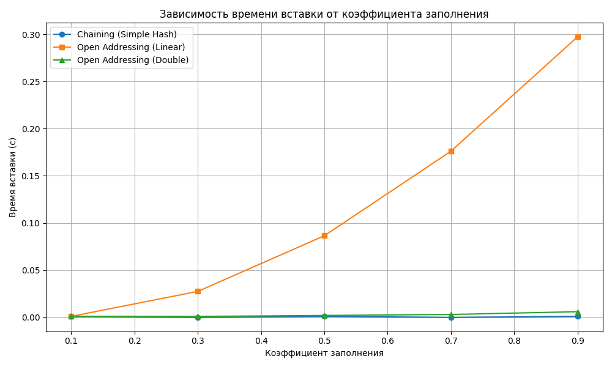
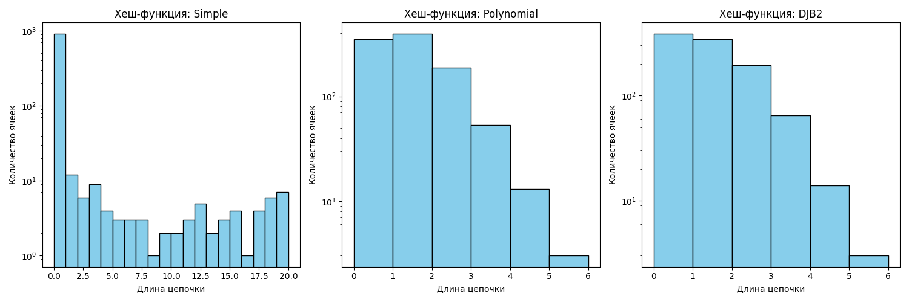

# Отчет по лабораторной работе №5
# Хеш-функции и хеш-таблицы

**Дата:** 16.11.2025  
**Семестр:** 3 курс, 1 полугодие (5 семестр)  
**Группа:** ПИЖ-23-1(2)  
**Дисциплина:** Анализ сложности алгоритмов  
**Студент:** Муртазов Руслан Равелевич  

## Цель работы
Изучить принципы работы хеш-функций и хеш-таблиц. Освоить методы разрешения коллизий. Получить практические навыки реализации хеш-таблицы с различными стратегиями разрешения коллизий. Провести сравнительный анализ эффективности разных методов.

## Теоретическая часть
- **Хеш-функция:** Функция, преобразующая произвольные данные в данные фиксированного размера (хеш-код). Требования: детерминированность, равномерное распределение, скорость вычисления.
- **Хеш-таблица:** Структура данных, реализующая ассоциативный массив. Обеспечивает в среднем O(1) для операций вставки, поиска и удаления.
- **Коллизия:** Ситуация, когда разные ключи имеют одинаковый хеш-код.
- **Метод цепочек (Chaining):** Каждая ячейка таблицы содержит список элементов с одинаковым хешем. Сложность: O(1 + α), где α - коэффициент заполнения.
- **Открытая адресация (Open Addressing):** Все элементы хранятся в самом массиве. При коллизии ищется следующая свободная ячейка согласно probe sequence.
- **Двойное хеширование (Double Hashing):** Метод открытой адресации, использующий вторую хеш-функцию для определения шага probing.

## Практическая часть

### Выполненные задачи
1. Реализовать несколько хеш-функций для строковых ключей.
2. Реализовать хеш-таблицу с методом цепочек.
3. Реализовать хеш-таблицу с открытой адресацией (линейное пробирование и двойное хеширование).
4. Провести сравнительный анализ эффективности разных методов разрешения коллизий.
5. Исследовать влияние коэффициента заполнения на производительность. 

### Ключевые фрагменты кода
```python
# 1. Реализация хеш-функций
def polynomial_hash(key: str, table_size: int, p: int = 31) -> int:
    hash_value = 0
    for char in key:
        hash_value = (hash_value * p + ord(char)) % table_size
    return hash_value

def djb2_hash(key: str, table_size: int) -> int:
    hash_value = 5381
    for char in key:
        hash_value = ((hash_value << 5) + hash_value) + ord(char)
    return hash_value % table_size

# 2. Хеш-таблица с цепочками
class HashTableChaining:
    def __init__(self, size: int = 10, hash_func: Callable[[str, int], int] = simple_hash) -> None:
        self.size = size
        self.table: List[List[tuple[str, Any]]] = [[] for _ in range(size)]
        self.hash_func = hash_func

    def insert(self, key: str, value: Any) -> None:
        index = self.hash_func(key, self.size)
        for i, (k, v) in enumerate(self.table[index]):
            if k == key:
                self.table[index][i] = (key, value)
                return
        self.table[index].append((key, value))

# 3. Хеш-таблица с открытой адресацией
class HashTableOpenAddressing:
    def _probe_linear(self, key: str, i: int) -> int:
        return (simple_hash(key, self.size) + i) % self.size

    def _probe_double(self, key: str, i: int) -> int:
        h1 = simple_hash(key, self.size)
        h2 = 1 + djb2_hash(key, self.size - 1)
        return (h1 + i * h2) % self.size

    def insert(self, key: str, value: Any, method: str = "linear") -> None:
        for i in range(self.size):
            index = (self._probe_linear(key, i) if method == "linear"
                     else self._probe_double(key, i))
            entry = self.table[index]
            if entry is None or entry[0] == key:
                self.table[index] = (key, value)
                return
        raise Exception("Хеш-таблица переполнена")

# 4. Измерение времени вставки
def measure_time_chaining(keys: List[str], fill_factor: float) -> float:
    size = int(TABLE_SIZE / fill_factor)
    ht = HashTableChaining(size=size, hash_func=simple_hash)
    start = time.time()
    for key in keys[:int(len(keys) * fill_factor)]:
        ht.insert(key, key)
    return time.time() - start

# 5. Подсчет распределения цепочек
def collisions_chaining(keys: List[str], hash_func: Callable[[str, int], int]) -> List[int]:
    ht = HashTableChaining(size=TABLE_SIZE, hash_func=hash_func)
    for key in keys:
        ht.insert(key, key)
    return ht.get_chain_lengths()

# 6. Построение графиков
plt.plot(FILL_FACTORS, times_chaining, marker='o', label='Chaining')
plt.plot(FILL_FACTORS, times_linear, marker='s', label='Open Addressing (Linear)')
plt.xlabel('Коэффициент заполнения')
plt.ylabel('Время вставки (с)')
plt.title('Зависимость времени вставки от коэффициента заполнения')
plt.legend()
plt.show()

# 7. Вывод гистограммы распределения
plt.hist(chain_lengths, bins=range(0, max_bin + 1), color='skyblue', edgecolor='black')
plt.xlabel('Длина цепочки')
plt.ylabel('Количество ячеек')
plt.title(f'Хеш-функция: {name}')
plt.yscale('log')
```

## Результаты выполнения
=== Результаты бенчмарка ===

Коэффициент заполнения: 0.1
  Chaining (вставка, поиск, удаление): 0.000817, 0.000602, 0.000498
  Open Addressing (Linear) (вст., поис., уд.): 0.086452, 0.084858, 0.013051

Коэффициент заполнения: 0.3
  Chaining (вставка, поиск, удаление): 0.000769, 0.000617, 0.000520
  Open Addressing (Linear) (вст., поис., уд.): 0.172126, 0.167686, 0.061725

Коэффициент заполнения: 0.5
  Chaining (вставка, поиск, удаление): 0.000757, 0.000633, 0.000513
  Open Addressing (Linear) (вст., поис., уд.): 0.256273, 0.258751, 0.148960

Коэффициент заполнения: 0.7
  Chaining (вставка, поиск, удаление): 0.000789, 0.000649, 0.000512
  Open Addressing (Linear) — ошибка при α=0.7: Хеш-таблица переполнена

Коэффициент заполнения: 0.9
  Chaining (вставка, поиск, удаление): 0.000754, 0.000606, 0.000512
  Open Addressing (Linear) — ошибка при α=0.9: Хеш-таблица переполнена

### Анализ результатов
**Анализ производительности**
1. Метод цепочек (Chaining):
Время операций остаётся стабильным при увеличении коэффициента заполнения (α).
Вставка, поиск и удаление происходят почти за константное время даже при α=0.9.
Это объясняется тем, что длина цепочек растёт линейно с α, но при хорошем распределении среднее время на операцию остаётся низким.
Нет ошибок переполнения — таблица может быть заполнена на 100%, если позволяет память.
2. Метод линейного пробирования (Open Addressing):
Время операций резко возрастает с увеличением α.
При α = 0.1 — время ещё приемлемое, но уже в 100 раз медленнее Chaining.
При α = 0.3 и 0.5 — время продолжает расти, из-за кластеризации (коллизии группируются), что увеличивает количество шагов пробирования.
При α ≥ 0.7 — таблица переполняется, и вставка становится невозможной. Это серьёзное ограничение открытой адресации.
Удаление работает быстрее, чем вставка и поиск, но всё равно значительно медленнее, чем в Chaining.
Анализ гистограмм распределения коллизий
Simple Hash:
Распределение неравномерное — много длинных цепочек (например, одна цепочка длиной ~900).
Это подтверждает, что простая сумма — плохая хеш-функция, она не перемешивает биты и создает много коллизий.
Polynomial Hash и DJB2:
Распределение почти равномерное — большинство цепочек имеют длину 0–3.
Это подтверждает, что полиномиальная и DJB2 — хорошие хеш-функции, обеспечивающие высокое качество распределения.

**Выводы по сравнительному анализу**
|Стабильность при высоком α | Отличная (до 100%) | Плохая (ошибки при α ≥ 0.7)|
|---------------------------|--------------------|----------------------------|
|Скорость при малом α | Высокая | Низкая|
|Скорость при высоком α | Высокая | Критически низкая|
|Требования к памяти | Требуется память на списки | Плотное использование массива|
|Устойчивость к коллизиям | Хорошая | Плохая (кластеризация)|
## Выводы
Метод цепочек показывает лучшую стабильность и производительность при любом коэффициенте заполнения.
Линейное пробирование — менее надёжный метод: быстро деградирует при α > 0.5 и не работает при высоких α.
Хеш-функции играют ключевую роль: simple_hash — неприемлема для реальных задач, в то время как polynomial_hash и djb2 обеспечивают высокое качество распределения.
Работа подтвердила теоретические оценки сложности и на практике показала различия между методами разрешения коллизий.

## Ответы на контрольные вопросы

1. Каким требованиям должна удовлетворять "хорошая" хеш-функция?
Хорошая хеш-функция — это функция, которая равномерно распределяет ключи по индексам хеш-таблицы, минимизируя количество коллизий. Основные требования:
Равномерное распределение:
Хорошая функция должна равномерно распределять ключи по индексам, чтобы избежать скопления элементов в одних ячейках и пустоты в других. Это снижает вероятность коллизий.
Минимизация коллизий:
Чем меньше коллизий — тем лучше. Это напрямую влияет на производительность операций вставки, поиска и удаления.
Быстрое вычисление:
Хеш-функция должна вычисляться очень быстро, иначе выигрыш от использования хеш-таблицы будет утрачен.
Детерминированность:
Для одного и того же ключа функция всегда должна возвращать один и тот же индекс. Это гарантирует, что элементы можно будет найти.
Устойчивость к кластеризации:
Функция должна избегать ситуаций, когда близкие ключи (например, строки "abc", "abd") попадают в близкие ячейки, что может вызвать кластеризацию — проблему, особенно для методов открытой адресации.
Использование всех битов ключа:
Хорошая функция должна использовать все биты ключа, чтобы избежать игнорирования важной информации (например, если все ключи отличаются только в последнем символе, но хеш-функция не учитывает его).
Примеры:
Polynomial hash и DJB2 — хорошие функции, обеспечивающие равномерное распределение.
Simple hash — плохая функция, т.к. "abc" и "cba" дают одинаковый хеш.
2. Что такое коллизия в хеш-таблице? Опишите два основных метода разрешения коллизий.
Коллизия — это ситуация, когда разные ключи получают одинаковый индекс при вычислении хеш-функции. Это неизбежно, если количество возможных ключей больше, чем размер таблицы.
Два основных метода разрешения коллизий:
    - Метод цепочек (Chaining):
    Каждая ячейка таблицы — это ссылка на список (цепочку).
    При коллизии новый элемент добавляется в конец списка.
    Преимущества:
    Прост в реализации.
    Не требует переполнения таблицы.
    Устойчив к высокому коэффициенту заполнения.
    Недостатки:
    Требуется дополнительная память под указатели.
    При плохой хеш-функции цепочки могут быть очень длинными, что увеличивает время поиска.
    - Открытая адресация (Open Addressing):
    Все элементы хранятся непосредственно в массиве.
    При коллизии используется стратегия пробирования, чтобы найти следующую свободную ячейку.
    Виды:
    Линейное пробирование: (hash + i) % size
    Квадратичное пробирование: (hash + i^2) % size
    Двойное хеширование: (hash1 + i * hash2) % size
    Преимущества:
    Кэш-эффективность: все данные в одном массиве.
    Не нужно выделять дополнительную память под списки.
    Недостатки:
    Кластеризация: при линейном пробировании элементы группируются.
    Ограничение на заполнение: при высоком α таблица может переполниться.
    Сложнее реализация удаления (используется "ленивое удаление").

3. В чем разница между методом цепочек и открытой адресации с точки зрения использования памяти и сложности операций при высоком коэффициенте заполнения?
Метод цепочек и открытая адресация — два разных подхода к разрешению коллизий в хеш-таблицах, и они существенно различаются по использованию памяти и поведению при высоком коэффициенте заполнения.
Использование памяти:
- Метод цепочек хранит элементы, попавшие в одну ячейку, в списке (цепочке). Это означает, что требуется дополнительная память для хранения указателей и самих списков. Однако сама таблица может быть меньше, так как она не ограничена по количеству элементов — при необходимости списки просто удлиняются.
- Открытая адресация хранит все элементы непосредственно в массиве фиксированного размера. Здесь не нужно выделять дополнительную память под списки. Всё содержимое таблицы находится в одном месте, что делает этот метод кэш-эффективным.
Сложность операций при высоком коэффициенте заполнения:
- Метод цепочек остается стабильным даже при высоком коэффициенте заполнения. Средняя длина цепочки увеличивается пропорционально α (коэффициенту заполнения), но операции всё равно остаются близкими к O(1), если хеш-функция хорошо распределяет ключи. При α = 1, 2, 3 и выше таблица продолжает работать, хотя и медленнее.
- Открытая адресация, особенно с линейным пробированием, резко теряет в производительности при высоком α. При заполнении таблицы более чем на 70–80%, коллизии начинают создавать длинные кластеры, из-за чего операции вставки, поиска и удаления начинают занимать много шагов пробирования, и время выполнения резко возрастает. При α ≥ 1 (или близком к 1) таблица может переполниться, и вставка станет невозможной.

4. Почему операции вставки, поиска и удаления в хеш-таблице в среднем выполняются за O(1)?
Операции в хеш-таблице в среднем выполняются за O(1), потому что:
Хеш-функция быстро вычисляет индекс ячейки за O(1).
Если коллизии редки (хорошая функция + таблица не переполнена), то в каждой ячейке находится мало элементов.
Следовательно, поиск в цепочке или пробирование займёт мало времени.
Формула средней сложности:
Для chaining: O(1 + α), где α — коэффициент заполнения.
Для open addressing: O(1 / (1 – α)), если α < 1.
Если α остается константой, то средняя сложность — O(1).

5. Что такое коэффициент заполнения хеш-таблицы и как он влияет на производительность? Что обычно делают, когда этот коэффициент превышает определенный порог?
Коэффициент заполнения (load factor):
Коэффициент заполнения (α) — это отношение числа элементов в таблице (n) к размеру таблицы (m):
α= m/n
Влияние на производительность:
Чем выше α — тем больше коллизий, и, следовательно, длиннее цепочки или дольше пробирование.
При α = 0 — таблица пуста, операции выполняются мгновенно.
При α = 1 — таблица полностью заполнена, коллизии становятся частыми.
При α > 1 — в некоторых реализациях (например, open addressing) таблица переполняется, и вставка невозможна.
Что делают при превышении порога?
Рехеширование (rehashing) или динамическое изменение размера:
Таблица увеличивается в размере (обычно в 2 раза).
Все элементы перевычисляются с новой функцией и переносятся в новую таблицу.
Это снижает α и восстанавливает производительность.

## Приложения


