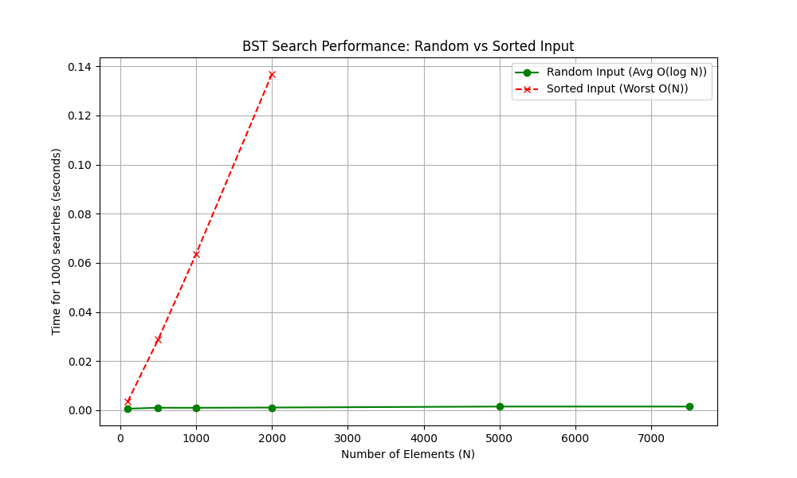

# Отчет по лабораторной работе №6
# Деревья. Бинарные деревья поиска

**Дата:** 29.11.2025  
**Семестр:** 3 курс, 1 полугодие (5 семестр)  
**Группа:** ПИЖ-23-1(2)  
**Дисциплина:** Анализ сложности алгоритмов  
**Студент:** Муртазов Руслан Равелевич  

## Цель работы
Изучить древовидные структуры данных, их свойства и применение. Освоить основные операции с бинарными деревьями поиска (BST). Получить практические навыки реализации BST на основе узлов, рекурсивных алгоритмов обхода и анализа их эффективности. Исследовать влияние сбалансированности дерева на производительность операций.

## Теоретическая часть
- **Дерево:** Рекурсивная структура данных, состоящая из узлов, где каждый узел имеет значение и ссылки на дочерние узлы.
- **Бинарное дерево поиска (BST):** Дерево, для которого выполняются условия: значение в левом поддереве меньше значения в узле, а в правом — больше.
- **Основные операции:** Вставка, Поиск, Удаление. Их сложность зависит от высоты дерева: $O(\log N)$ в среднем и $O(N)$ в худшем случае (вырожденное дерево).
- **Обход (Traversal):** 
    - *In-order (Центрированный):* Левый -> Корень -> Правый (выводит отсортированные значения).
    - *Pre-order (Прямой):* Корень -> Левый -> Правый.
    - *Post-order (Обратный):* Левый -> Правый -> Корень.
- **Сбалансированность:** Свойство дерева, гарантирующее логарифмическую высоту, что предотвращает деградацию производительности до уровня связного списка.

## Практическая часть

### Выполненные задачи
1. Реализован класс `BinarySearchTree` с методами вставки (`insert`), поиска (`search`) и удаления (`delete`) узлов.
2. Реализована валидация корректности BST (`is_valid_bst`).
3. Реализованы рекурсивные методы обхода (in-order, pre-order, post-order) и итеративный in-order обход.
4. Проведен сравнительный анализ времени поиска в сбалансированном (случайные данные) и вырожденном (отсортированные данные) дереве.
5. Построены графики зависимости времени выполнения от количества элементов.

### Ключевые фрагменты кода

```python
# 1. Структура узла и вставка
class TreeNode:
    def __init__(self, key: int) -> None:
        self.val = key
        self.left = None
        self.right = None

def _insert_recursive(self, node: TreeNode, key: int) -> None:
    if key < node.val:
        if node.left is None:
            node.left = TreeNode(key)
        else:
            self._insert_recursive(node.left, key)
    else:
        # Логика для правой ветки аналогична

# 2. Удаление узла (наиболее сложная операция)
def _delete_recursive(self, node: Optional[TreeNode], key: int) -> Optional[TreeNode]:
    # ... поиск узла ...
    else:
        # Случай: 0 или 1 ребенок
        if node.left is None: return node.right
        elif node.right is None: return node.left

        # Случай: 2 ребенка
        temp = self.find_min(node.right) # Ищем преемника
        node.val = temp.val
        node.right = self._delete_recursive(node.right, temp.val)
    return node

# 3. Валидация BST
def _is_valid_helper(self, node: Optional[TreeNode], min_val: float, max_val: float) -> bool:
    if node is None:
        return True
    if not (min_val < node.val < max_val):
        return False
    return (self._is_valid_helper(node.left, min_val, node.val) and
            self._is_valid_helper(node.right, node.val, max_val))

# 4. Обходы (TreeTraversal)
@staticmethod
def in_order(node: Optional[TreeNode]) -> List[int]:
    res = []
    if node:
        res = TreeTraversal.in_order(node.left)
        res.append(node.val)
        res = res + TreeTraversal.in_order(node.right)
    return res
```

## Результаты выполнения
=== Результаты замеров времени поиска (1000 операций) ===

| Size (N) | Random Input (sec) | Sorted Input (sec) |
| :--- | :--- | :--- |
| 100 | 0.000635 | 0.003542 |
| 500 | 0.001023 | 0.028699 |
| 1000 | 0.001006 | 0.063532 |
| 2000 | 0.001109 | 0.136858 |
| 5000 | 0.001510 | Skipped |
| 7500 | 0.001509 | Skipped |

*Примечание: Для отсортированных данных тесты на N=5000 и выше были пропущены во избежание ошибки переполнения стека рекурсии и чрезмерно долгого выполнения.*

### Анализ результатов

1.  **Случайные данные (Random Input):**
    *   Время выполнения растет крайне медленно (от ~0.0006 до ~0.0015 сек при увеличении N в 75 раз).
    *   Это подтверждает логарифмическую сложность $O(\log N)$. При случайной вставке дерево получается достаточно сбалансированным, его высота невелика.

2.  **Отсортированные данные (Sorted Input):**
    *   Наблюдается резкий рост времени выполнения. При N=2000 время составляет ~0.137 сек, что в **123 раза медленнее**, чем для случайных данных того же объема.
    *   Зависимость времени от N близка к линейной (с учетом накладных расходов). Это подтверждает сложность $O(N)$.
    *   Дерево вырождается в связный список (все элементы уходят в правую ветку), высота дерева становится равной $N$.

## Выводы
В ходе работы было реализовано бинарное дерево поиска и основные алгоритмы работы с ним.
Экспериментально подтверждено, что эффективность BST напрямую зависит от структуры данных:
*   В **сбалансированном** (или близком к нему) состоянии операции выполняются за $O(\log N)$, что делает BST крайне эффективной структурой.
*   При подаче **упорядоченных данных** дерево вырождается, и производительность падает до $O(N)$, что делает его неэффективным (сравнимым с обычным поиском в массиве).
Для решения проблемы вырождения в реальных задачах необходимо использовать самобалансирующиеся деревья (например, AVL или красно-черные).

## Ответы на контрольные вопросы

1.  **Сформулируйте основное свойство бинарного дерева поиска (BST).**
    Основное свойство BST заключается в упорядоченности узлов: для любого узла `X` все ключи в его **левом** поддереве меньше ключа `X`, а все ключи в его **правом** поддереве больше ключа `X`. Это свойство должно выполняться рекурсивно для всех узлов дерева.

2.  **Опишите алгоритм вставки нового элемента в BST. Какова сложность этой операции в сбалансированном и вырожденном дереве?**
    Алгоритм вставки:
    1. Начинаем с корня.
    2. Сравниваем вставляемое значение со значением текущего узла.
    3. Если значение меньше — переходим в левое поддерево, если больше — в правое.
    4. Повторяем, пока не достигнем `None` (пустой ссылки). На этом месте создаем новый узел.
    
    Сложность:
    *   Сбалансированное дерево: $O(\log N)$, так как высота дерева $H \approx \log N$.
    *   Вырожденное дерево: $O(N)$, так как высота $H \approx N$ (дерево превращается в линию).

3.  **Чем отличается обход дерева в глубину (DFS) от обхода в ширину (BFS)? Назовите виды DFS-обходов и их особенности.**
    *   **DFS (Depth-First Search)** идет "вглубь" по ветке до листа, затем возвращается. Реализуется через стек или рекурсию.
    *   **BFS (Breadth-First Search)** обходит дерево по уровням (сначала корень, потом все дети, потом внуки). Реализуется через очередь.
    
    Виды DFS:
    *   *Pre-order (Root-Left-Right):* Полезен для копирования дерева.
    *   *In-order (Left-Root-Right):* Выводит элементы BST в отсортированном порядке.
    *   *Post-order (Left-Right-Root):* Полезен для удаления дерева (удаляем детей перед родителем).

4.  **Почему в вырожденном BST (например, когда элементы добавляются в отсортированном порядке) сложность операций поиска и вставки становится O(n)?**
    При добавлении отсортированных данных каждый новый элемент всегда больше предыдущего и добавляется только в правую ветку (или только в левую при обратной сортировке). Дерево не ветвится, а выстраивается в одну длинную цепочку (связный список). Высота такого дерева равна количеству элементов $N$. Поскольку поиск и вставка проходят путь от корня до места назначения, в худшем случае приходится проходить все $N$ узлов.

5.  **Что такое сбалансированное дерево (например, AVL-дерево) и как оно решает проблему вырождения BST?**
    Сбалансированное дерево — это BST, которое автоматически поддерживает свою высоту минимально возможной (порядка $\log N$) при вставке и удалении элементов.
    AVL-дерево решает проблему вырождения путем отслеживания "фактора баланса" для каждого узла (разница высот левого и правого поддеревьев). Если при вставке/удалении баланс нарушается (разница > 1), выполняются специальные операции — **вращения** (повороты) узлов, которые восстанавливают структуру дерева, гарантируя сложность операций $O(\log N)$ в худшем случае.

## Приложения
