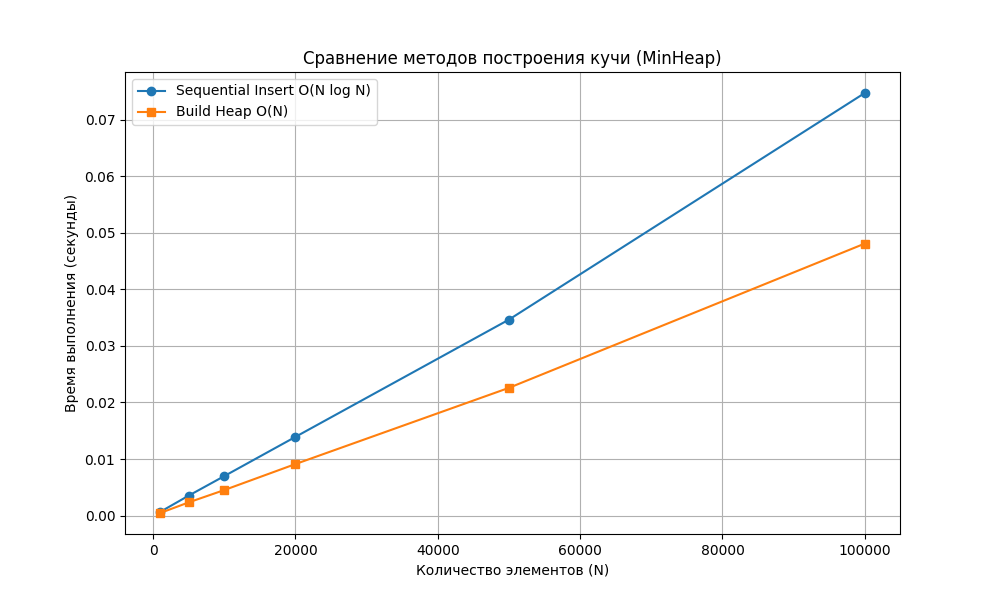

# Отчет по лабораторной работе №7
# Кучи (Heaps)

**Дата:** 30.11.2025  
**Семестр:** 3 курс, 1 полугодие (5 семестр)  
**Группа:** ПИЖ-23-1(2)  
**Дисциплина:** Анализ сложности алгоритмов  
**Студент:** Муртазов Руслан Равелевич  

## Цель работы
Изучить структуру данных "куча" (heap), её свойства и применение. Освоить основные операции с кучей (добавление, извлечение корня) и алгоритм её построения. Получить практические навыки реализации кучи на основе массива (array-based). Исследовать эффективность основных операций и сравнить различные подходы к построению кучи.

## Теоретическая часть
- **Куча (Heap):** Специализированная древовидная структура данных, удовлетворяющая свойству кучи. Является полным бинарным деревом (все уровни заполнены, кроме, возможно, последнего).
- **Свойство Min-Heap:** Значение в любом узле меньше или равно значениям его потомков. Корень — минимальный элемент.
- **Представление в массиве:** Для узла с индексом `i`:
    - Левый потомок: `2*i + 1`
    - Правый потомок: `2*i + 2`
    - Родитель: `(i-1) // 2`
- **Основные операции:**
    - *Insert (Вставка):* Добавление в конец + всплытие (`sift_up`). Сложность $O(\log N)$.
    - *Extract (Извлечение):* Удаление корня, замена его последним элементом + погружение (`sift_down`). Сложность $O(\log N)$.
    - *Build Heap (Построение):* Из произвольного массива. Последовательная вставка занимает $O(N \log N)$, а алгоритм Флойда (просеивание вниз с середины массива) — $O(N)$.
- **Пирамидальная сортировка (Heapsort):** Алгоритм сортировки, использующий кучу. Сложность $O(N \log N)$ в худшем, среднем и лучшем случаях. Не требует дополнительной памяти ($O(1)$).

## Практическая часть

### Выполненные задачи
1. Реализован класс `MinHeap` с методами `insert`, `extract`, `peek` и `build_heap`.
2. Реализованы вспомогательные методы `_sift_up` и `_sift_down` для восстановления свойств кучи.
3. Реализован алгоритм сортировки кучей `heapsort`.
4. Проведен сравнительный анализ времени построения кучи двумя способами: последовательными вставками и методом `build_heap`.
5. Построены графики зависимости времени выполнения от количества элементов.

### Ключевые фрагменты кода

```python
# 1. Структура класса и основные методы
class MinHeap:
    def __init__(self) -> None:
        self.heap: List[int] = []

    def _sift_down(self, index: int) -> None:
        """Опускает элемент вниз для восстановления свойств кучи O(log N)."""
        size = len(self.heap)
        while True:
            left = 2 * index + 1
            right = 2 * index + 2
            smallest = index

            if left < size and self.heap[left] < self.heap[smallest]:
                smallest = left
            if right < size and self.heap[right] < self.heap[smallest]:
                smallest = right

            if smallest != index:
                self.heap[index], self.heap[smallest] = self.heap[smallest], self.heap[index]
                index = smallest
            else:
                break

    # 2. Оптимизированное построение кучи O(N)
    def build_heap(self, array: List[int]) -> None:
        self.heap = array[:]
        # Начинаем с последнего родителя и идем к корню
        for i in range((len(self.heap) // 2) - 1, -1, -1):
            self._sift_down(i)

# 3. Сортировка кучей
def heapsort(array: List[int]) -> List[int]:
    heap = MinHeap()
    heap.build_heap(array)  # O(N)
    sorted_array = []
    while True:             # N * O(log N)
        val = heap.extract()
        if val is None:
            break
        sorted_array.append(val)
    return sorted_array
```

## Результаты выполнения
=== Сравнение методов построения кучи ===

| Size (N) | Sequential Insert (s) | Optimized Build (s) |
| :--- | :--- | :--- |
| 1000 | 0.00066 | 0.00046 |
| 5000 | 0.00353 | 0.00234 |
| 10000 | 0.00698 | 0.00451 |
| 20000 | 0.01391 | 0.00911 |
| 50000 | 0.03464 | 0.02258 |
| 100000 | 0.07468 | 0.04807 |

### Анализ результатов

1.  **Sequential Insert (Последовательная вставка):**
    *   Сложность этого метода составляет $O(N \log N)$, так как мы $N$ раз вызываем операцию вставки стоимостью $O(\log N)$.
    *   На 100,000 элементах время составило **0.07468 с**.

2.  **Optimized Build (Алгоритм Флойда):**
    *   Сложность метода составляет $O(N)$. Это достигается за счет того, что `sift_down` вызывается для узлов снизу вверх, и для большинства узлов (листьев и нижних уровней) высота поддерева мала.
    *   На 100,000 элементах время составило **0.04807 с**.

3.  **Сравнение:**
    *   Оптимизированный метод работает быстрее во всех тестах.
    *   На максимальном наборе данных (100k) выигрыш в производительности составляет примерно **1.55 раза**.
    *   Графики подтверждают линейный рост для `build_heap` и чуть более быстрый рост для последовательной вставки.

## Выводы
В ходе лабораторной работы была изучена структура данных Min-Heap.
Экспериментально подтверждено теоретическое преимущество алгоритма построения кучи "на месте" (`build_heap`) перед последовательной вставкой элементов. Использование массива для представления бинарного дерева оказалось эффективным способом управления памятью. Реализованная сортировка кучей (`heapsort`) продемонстрировала стабильную работу и является отличным примером применения данной структуры данных.

## Ответы на контрольные вопросы

1.  **Сформулируйте основное свойство min-кучи и max-кучи.**
    *   **Min-Heap:** Значение в любом узле **меньше или равно** значениям его потомков. Минимальный элемент всегда находится в корне.
    *   **Max-Heap:** Значение в любом узле **больше или равно** значениям его потомков. Максимальный элемент всегда находится в корне.

2.  **Опишите алгоритм операции вставки нового элемента в кучу (процедуру sift_up).**
    1. Новый элемент добавляется в самый конец массива (первое свободное место в дереве).
    2. Сравниваем добавленный элемент с его родителем.
    3. Если порядок нарушен (для Min-Heap: элемент < родителя), меняем их местами.
    4. Повторяем шаг 2 и 3 для нового положения элемента, пока порядок не восстановится или элемент не станет корнем.

3.  **Какова временная сложность построения кучи из произвольного массива и почему она равна O(n), а не O(n log n)?**
    Если строить кучу методом `sift_down` (просеивание вниз), начиная с последних родительских узлов и двигаясь к корню, то сумма высот всех узлов сходится к линейной зависимости. Большинство узлов находятся внизу дерева, где высота поддерева мала (0 или 1), и операции для них дешевы. Математически ряд $\sum \frac{h}{2^h}$ сходится, давая итоговую сложность $O(N)$. Если же использовать `sift_up` (вставку), то сложность будет $O(N \log N)$.

4.  **Опишите, как работает алгоритм пирамидальной сортировки (Heapsort).**
    1. Строим Max-Heap из исходного массива (Сложность $O(N)$).
    2. Меняем местами корень (максимум) с последним элементом массива.
    3. Уменьшаем размер рассматриваемой кучи на 1 (последний элемент теперь считается отсортированным).
    4. Вызываем `sift_down` для нового корня, чтобы восстановить свойство кучи.
    5. Повторяем шаги 2-4, пока куча не станет пустой.

5.  **Почему кучу часто используют для реализации приоритетной очереди? Какие операции приоритетной очереди она эффективно поддерживает?**
    Куча идеально подходит для приоритетной очереди, так как она обеспечивает быстрый доступ к элементу с наивысшим приоритетом (O(1) для чтения корня).
    Она эффективно поддерживает:
    *   Вставку элемента с приоритетом: $O(\log N)$.
    *   Извлечение элемента с наивысшим приоритетом: $O(\log N)$.
    Это быстрее, чем в отсортированном массиве (вставка $O(N)$) или несортированном списке (поиск $O(N)$).

## Приложения
