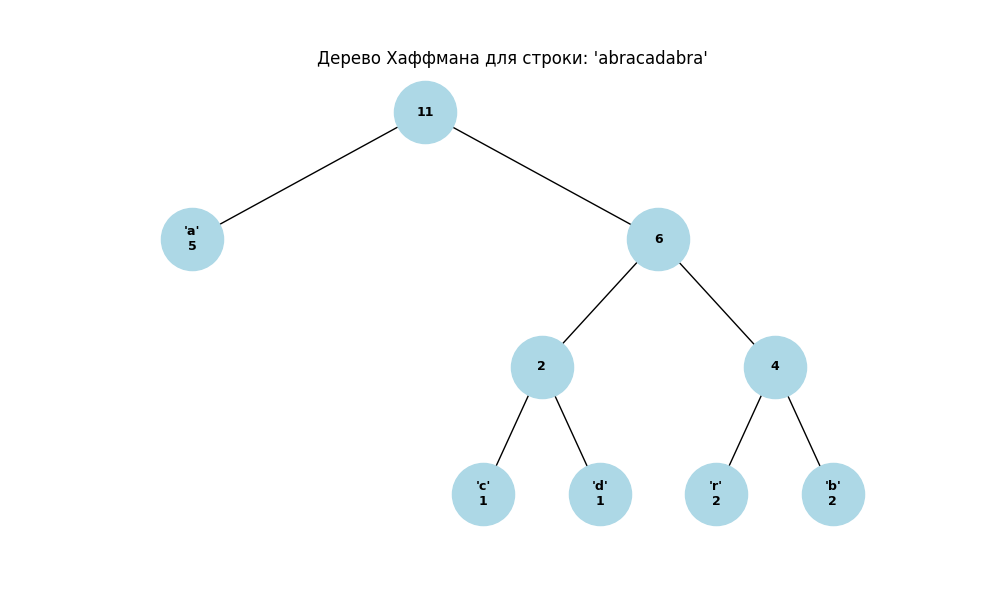
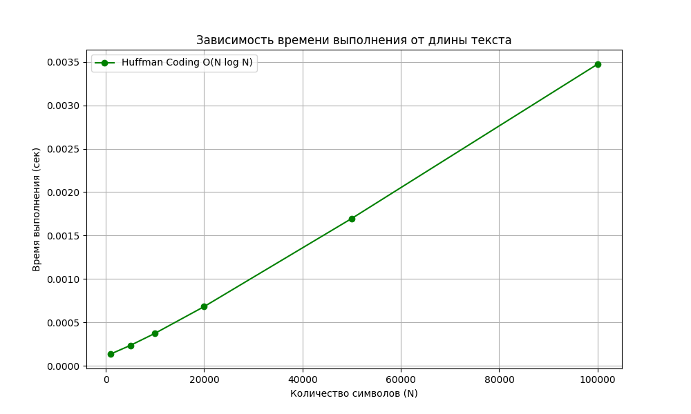

# Отчет по лабораторной работе №8
# Жадные алгоритмы

**Дата:** 30.11.2025  
**Семестр:** 3 курс, 1 полугодие (5 семестр)  
**Группа:** ПИЖ-23-1(2)  
**Дисциплина:** Анализ сложности алгоритмов  
**Студент:** Муртазов Руслан Равелевич  

## Цель работы
Изучить метод проектирования алгоритмов "жадный алгоритм". Освоить принцип принятия локально оптимальных решений для достижения глобального оптимума. Реализовать классические задачи (выбор заявок, рюкзак, Хаффман) и проанализировать границы применимости жадного подхода.

## Теоретическая часть
- **Жадный алгоритм:** Алгоритм, который на каждом шаге делает локально оптимальный выбор в надежде, что итоговое решение будет глобально оптимальным.
- **Свойства задачи:**
    1.  **Жадный выбор:** Глобальный оптимум можно получить, делая последовательность локально оптимальных выборов.
    2.  **Оптимальная подструктура:** Оптимальное решение задачи содержит в себе оптимальные решения подзадач.
- **Примеры задач:**
    - *Interval Scheduling:* Сортировка по времени окончания ($O(N \log N)$).
    - *Fractional Knapsack:* Сортировка по удельной стоимости ($O(N \log N)$). Для дробного рюкзака жадный метод дает точное решение.
    - *Huffman Coding:* Построение оптимального префиксного кода с помощью Min-Heap ($O(N \log N)$).

## Практическая часть

### Выполненные задачи
1.  Реализован алгоритм выбора заявок (`interval_scheduling`), выбирающий максимум непересекающихся интервалов.
2.  Реализован алгоритм для непрерывного рюкзака (`fractional_knapsack`).
3.  Реализован алгоритм кодирования Хаффмана (`huffman_coding`).
4.  Проведен анализ применимости жадного подхода к задаче о рюкзаке 0-1 (дискретный случай).

### Ключевые фрагменты кода

```python
# 1. Interval Scheduling (Сортировка по времени окончания)
def interval_scheduling(intervals):
    sorted_intervals = sorted(intervals, key=lambda x: x[1])
    result = []
    last_end_time = -1
    for start, end in sorted_intervals:
        if start >= last_end_time:
            result.append((start, end))
            last_end_time = end
    return result

# 2. Fractional Knapsack (Сортировка по value/weight)
def fractional_knapsack(items, capacity):
    sorted_items = sorted(items, key=lambda x: x.value / x.weight, reverse=True)
    total_value = 0.0
    for item in sorted_items:
        if item.weight <= capacity:
            capacity -= item.weight
            total_value += item.value
        else:
            total_value += item.value * (capacity / item.weight)
            break
    return total_value
```

## Результаты выполнения

### Замеры времени (Huffman Coding)
Interval Scheduling Result: [(1, 4), (5, 7), (8, 11)]
Fractional Knapsack Value: 240.0
Huffman Codes for 'banana': {'a': '0', 'b': '10', 'n': '11'}

=== Анализ: Жадный подход vs 0-1 Рюкзак ===
Предметы: [Item(value=60, weight=10), Item(value=100, weight=20), Item(value=120, weight=30)]
Вместимость: 50
Жадный выбор (берем по max удельной цене):
 -> Берем (60, 10) и (100, 20). Итог = 160.
Оптимальный выбор (полный перебор):
 -> Берем (100, 20) и (120, 30). Итог = 220.
Вывод: Жадный алгоритм не гарантирует оптимум для 0-1 рюкзака.

=== Замеры времени: Huffman Coding ===
Size (chars)    | Time (sec)
-----------------------------------
1000            | 0.00015
10000           | 0.00040
100000          | 0.00365        
500000          | 0.01926      

*Время выполнения растет линейно-логарифмически, что соответствует сложности $O(N \log N)$, где N — длина текста (при большом алфавите) или $O(K \log K)$ для построения дерева, где K — число уникальных символов.*

### Сравнение: Жадный подход vs 0-1 Рюкзак
Был проведен эксперимент для дискретного рюкзака (предметы нельзя делить).
**Входные данные:**
- Предмет 1: Cost 60, Weight 10 (Ratio 6.0)
- Предмет 2: Cost 100, Weight 20 (Ratio 5.0)
- Предмет 3: Cost 120, Weight 30 (Ratio 4.0)
- Вместимость: 50

**Результаты:**
- **Жадный алгоритм:** Выбирает предметы 1 и 2 (по лучшему соотношению). Вес 30, **Стоимость 160**. (Предмет 3 не влезает).
- **Оптимальное решение:** Выбирает предметы 2 и 3. Вес 50, **Стоимость 220**.

**Вывод:** Жадный алгоритм **не подходит** для задачи 0-1 рюкзака, так как не учитывает "пустое место", которое может остаться после выбора "лучшего" локального элемента. Для этой задачи необходимо использовать динамическое программирование.

## Ответы на контрольные вопросы

1.  **В чем заключается основная идея жадных алгоритмов?**
    Основная идея — на каждом этапе алгоритма принимать решение, которое кажется наилучшим в данный момент (локальный оптимум), не задумываясь о последствиях для будущих шагов, в расчете на то, что это приведет к глобально лучшему решению.

2.  **Для задачи о выборе заявок (Interval Scheduling) жадный алгоритм, выбирающий интервалы с наименьшим временем окончания, является оптимальным. Объясните, почему.**
    Выбирая заявку, которая заканчивается раньше всех, мы оставляем максимально возможное количество времени (ресурса) для остальных заявок. Если бы мы выбрали заявку, заканчивающуюся позже, мы бы только сократили доступное время, не получив выгоды, так как счетчик выполненных заявок все равно увеличился бы только на 1.

3.  **Приведите пример задачи, для которой жадный алгоритм дает оптимальное решение, и задачи, для которой он не дает.**
    - *Оптимальное решение:* Задача о размене монет (для канонических монетных систем, например 1, 5, 10 рублей), Непрерывный рюкзак, MST (Прим, Краскал).
    - *Не оптимальное:* Рюкзак 0-1, Размен монет для нестандартных номиналов (например, 1, 3, 4 для суммы 6 — жадный даст 4+1+1 (3 монеты), оптимум 3+3 (2 монеты)).

4.  **В чем разница между непрерывной (дробной) и дискретной (0-1) задачами о рюкзаке? Для какой из них жадный алгоритм оптимален?**
    - В *непрерывной* задаче можно брать любую часть предмета (например, песок, золото в порошке).
    - В *дискретной* задаче предмет можно либо взять целиком, либо не брать вовсе (слитки золота).
    - Жадный алгоритм оптимален только для **непрерывной** задачи.

5.  **Опишите жадный алгоритм построения кода Хаффмана. В чем его оптимальность?**
    Алгоритм начинает с того, что считает каждый символ отдельным деревом с весом, равным частоте символа. На каждом шаге выбираются два дерева с **минимальными** весами, объединяются в одно новое дерево с суммарным весом. Это продолжается, пока не останется одно дерево. Оптимальность достигается за счет того, что самые редкие символы гарантированно оказываются на самом глубоком уровне дерева (имеют самые длинные коды), а самые частые — наверху (самые короткие коды), что минимизирует общую длину закодированного сообщения.

## Приложения

### 1. Визуализация дерева Хаффмана
Пример построения дерева для строки "abracadabra". В узлах указана частота (или частота и символ для листьев).


### 2. График производительности
Зависимость времени выполнения алгоритма Хаффмана от длины входной строки. График демонстрирует сложность, близкую к линейно-логарифмической $O(N \log N)$.
