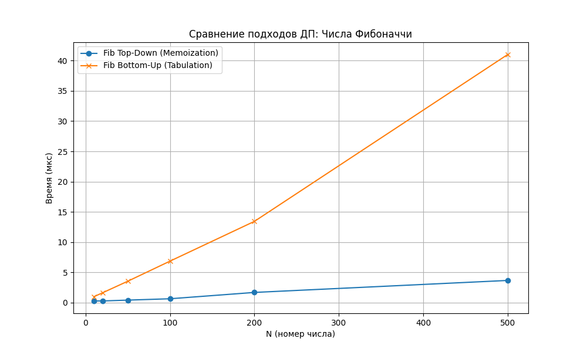

# Отчет по лабораторной работе №9
# Динамическое программирование

**Дата:** 11.12.2025
**Семестр:** 3 курс, 1 полугодие (5 семестр)
**Группа:** ПИЖ-23-1(2)
**Дисциплина:** Анализ сложности алгоритмов
**Студент:** Муртазов Руслан Равелевич

## Цель работы
Изучить метод динамического программирования (ДП) как инструмент для решения сложных задач путем разбиения их на перекрывающиеся подзадачи. Освоить два основных подхода к реализации ДП: нисходящий (с мемоизацией) и восходящий (табличный). Реализовать классические алгоритмы (Числа Фибоначчи, Рюкзак 0-1, LCS, LIS) и провести сравнительный анализ их эффективности.

## Теоретическая часть
- **Динамическое программирование (ДП):** Метод решения задач, при котором оптимальное решение всей задачи строится из оптимальных решений её подзадач.
- **Ключевые свойства:**
    1.  **Оптимальная подструктура:** Оптимальное решение задачи содержит в себе оптимальные решения её подзадач.
    2.  **Перекрывающиеся подзадачи:** Одни и те же подзадачи возникают в процессе решения многократно.
- **Подходы к реализации:**
    - **Нисходящий (Top-Down):** Рекурсивное решение с сохранением результатов (мемоизация). Позволяет решать только необходимые подзадачи.
    - **Восходящий (Bottom-Up):** Итеративное заполнение таблицы от простых случаев к сложным. Исключает накладные расходы на рекурсию.

## Практическая часть

### Выполненные задачи
1.  Реализовано вычисление чисел Фибоначчи двумя способами: рекурсивно с мемоизацией и итеративно.
2.  Реализован алгоритм решения задачи о рюкзаке 0-1 (дискретный случай) через заполнение 2D-таблицы.
3.  Реализован поиск наибольшей общей подпоследовательности (LCS) двумя способами.
4.  Решены дополнительные задачи: "Размен монет" (Coin Change) и "Наибольшая возрастающая подпоследовательность" (LIS).
5.  Проведен сравнительный анализ времени выполнения подходов Top-Down и Bottom-Up.

### Ключевые фрагменты кода

```python
# 1. Задача о рюкзаке 0-1 (Bottom-Up)
def knapsack_0_1(capacity: int, weights: List[int], values: List[int]) -> int:
    n_items = len(weights)
    dp = [[0 for _ in range(capacity + 1)] for _ in range(n_items + 1)]

    for i in range(1, n_items + 1):
        for w in range(1, capacity + 1):
            weight = weights[i - 1]
            value = values[i - 1]
            if weight <= w:
                # Максимум: берем предмет или не берем
                dp[i][w] = max(
                    value + dp[i - 1][w - weight],
                    dp[i - 1][w]
                )
            else:
                dp[i][w] = dp[i - 1][w]
    return dp[n_items][capacity]

# 2. LCS (Наибольшая общая подпоследовательность) - Top-Down
def lcs_top_down(s1: str, s2: str, i: int, j: int,
                 memo: Optional[Dict[str, int]] = None) -> int:
    if memo is None: memo = {}
    key = f"{i},{j}"
    if key in memo: return memo[key]

    if i == len(s1) or j == len(s2):
        return 0

    if s1[i] == s2[j]:
        res = 1 + lcs_top_down(s1, s2, i + 1, j + 1, memo)
    else:
        res = max(
            lcs_top_down(s1, s2, i + 1, j, memo),
            lcs_top_down(s1, s2, i, j + 1, memo)
        )
    memo[key] = res
    return res

# 3. Размен монет (Coin Change)
def coin_change(coins: List[int], amount: int) -> Union[int, float]:
    dp = [float('inf')] * (amount + 1)
    dp[0] = 0
    for x in range(1, amount + 1):
        for coin in coins:
            if x - coin >= 0:
                dp[x] = min(dp[x], 1 + dp[x - coin])
    return dp[amount] if dp[amount] != float('inf') else -1
```

## Результаты выполнения

### Сравнительный анализ производительности (LCS)
Было проведено сравнение времени выполнения алгоритма поиска LCS для строк одинаковой длины при использовании рекурсии с мемоизацией (Top-Down) и табличного метода (Bottom-Up).

**Сравнение LCS для строк одинаковой длины:**

| Len | Top-Down (мкс) | Bottom-Up (мкс) |
| --- | -------------- | --------------- |
| 5   | 1.3250         | 7.3000          |
| 10  | 1.9850         | 21.0000         |
| 15  | 3.7750         | 43.7650         |
| 20  | 5.4650         | 74.6000         |
| 50  | 29.9950        | 434.0300        |

**Выводы по результатам:**
1.  Оба подхода имеют схожую асимптотическую сложность: $O(N)$ для чисел Фибоначчи и $O(N \cdot M)$ для задачи LCS.
2.  В данном эксперименте на малых данных (Len < 50) Top-Down показал себя быстрее, вероятно, из-за того, что не заполнял всю таблицу (ленивое вычисление), либо из-за накладных расходов на создание списка списков в Python.
3.  Однако, теоретически Bottom-Up (табличный метод) часто работает стабильнее на больших данных, так как исключает риск переполнения стека рекурсии и затраты на создание фреймов функций.

## Ответы на контрольные вопросы

1.  **Какие два основных свойства задачи указывают на то, что для ее решения можно применить динамическое программирование?**
    Это **оптимальная подструктура** (решение задачи складывается из оптимальных решений подзадач) и **перекрывающиеся подзадачи** (подзадачи повторяются многократно, и их результаты можно закэшировать).

2.  **В чем разница между нисходящим (top-down) и восходящим (bottom-up) подходами в динамическом программировании?**
    *Top-down* использует рекурсию и мемоизацию: мы начинаем с основной задачи и углубляемся, запоминая ответы.
    *Bottom-up* использует итерацию и таблицы: мы решаем сначала самые маленькие подзадачи и используем их ответы для построения более сложных, двигаясь "снизу вверх".

3.  **Как задача о рюкзаке 0-1 демонстрирует свойство оптимальной подструктуры?**
    Чтобы определить максимальную стоимость для $i$ предметов и вместимости $W$, мы рассматриваем два варианта для $i$-го предмета:
    1. Не берем его: результат равен оптимуму для $i-1$ предметов и вместимости $W$.
    2. Берем его: результат равен стоимости $i$-го предмета + оптимум для $i-1$ предметов и вместимости $W - weight_i$.
    Выбор максимума из этих двух вариантов и есть оптимальное решение текущей задачи, основанное на решениях предыдущих.

4.  **Опишите, как строится и заполняется таблица для решения задачи о наибольшей общей подпоследовательности (LCS).**
    Создается таблица размером $(N+1) \times (M+1)$.
    - Если символы `s1[i]` и `s2[j]` совпадают, то значение ячейки равно `1 + dp[i-1][j-1]` (диагональный элемент).
    - Если не совпадают, то берется максимум из соседей сверху и слева: `max(dp[i-1][j], dp[i][j-1])`.
    Результат находится в правой нижней ячейке.

5.  **Как с помощью динамического программирования можно уменьшить сложность вычисления чисел Фибоначчи с экспоненциальной до линейной или даже до O(log n)?**
    Наивная рекурсия дает $O(2^n)$.
    - Использование ДП (мемоизация или массив) позволяет вычислять каждое число только один раз, снижая сложность до $O(n)$.
    - Использование матричного умножения (возведение матрицы $\begin{pmatrix} 1 & 1 \\ 1 & 0 \end{pmatrix}$ в степень $n$) позволяет достичь сложности $O(\log n)$.

## Приложения

### 1. График сравнения производительности (Fibonacci)
График, построенный скриптом `analysis.py`, демонстрирует линейный рост времени выполнения для обоих методов ДП, в отличие от экспоненциального роста наивной рекурсии.
