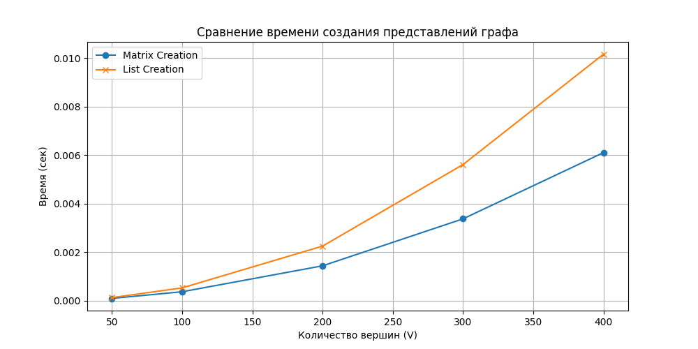
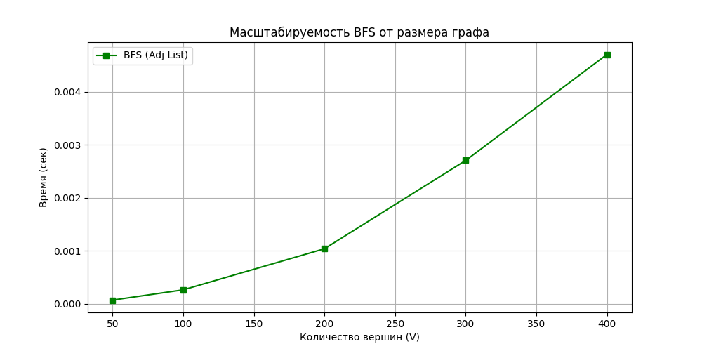

# Отчет по лабораторной работе №10
# Графы

**Дата:** 13.12.2025
**Семестр:** 3 курс, 1 полугодие (5 семестр)
**Группа:** ПИЖ-23-1(2)
**Дисциплина:** Анализ сложности алгоритмов
**Студент:** Муртазов Руслан Равелевич

## Цель работы
Изучить основные понятия теории графов и алгоритмы работы с ними. Освоить представления графов в памяти (матрица смежности, список смежности) и основные алгоритмы обхода (BFS, DFS). Получить практические навыки реализации алгоритмов поиска компонент связности, топологической сортировки и кратчайших путей (алгоритм Дейкстры), а также провести анализ их сложности.

## Теоретическая часть
- **Граф:** Множество вершин (узлов) и рёбер (связей). Графы бывают ориентированные/неориентированные, взвешенные/невзвешенные.
- **Представление графов:**
    - **Матрица смежности:** Двумерный массив $V \times V$. Расход памяти $O(V^2)$. Быстрая проверка наличия ребра $O(1)$, но медленный перебор соседей.
    - **Список смежности:** Список списков, где для каждой вершины хранятся ее соседи. Расход памяти $O(V + E)$. Эффективен для разреженных графов.
- **Алгоритмы обхода:**
    - **BFS (Поиск в ширину):** Использует очередь. Посещает вершины слоями. Находит кратчайший путь в невзвешенном графе.
    - **DFS (Поиск в глубину):** Использует стек (или рекурсию). Уходит вглубь ветви до упора. Используется для топологической сортировки и поиска циклов.

## Практическая часть

### Выполненные задачи
1.  Реализованы классы `AdjacencyMatrixGraph` и `AdjacencyListGraph` с методами добавления/удаления рёбер.
2.  Реализованы алгоритмы обхода: BFS (итеративный с очередью) и DFS (итеративный и рекурсивный).
3.  Решены практические задачи:
    - Поиск компонент связности в неориентированном графе.
    - Топологическая сортировка для ориентированного ациклического графа (DAG).
4.  Реализован алгоритм Дейкстры для поиска кратчайших путей во взвешенном графе.
5.  Проведен сравнительный анализ производительности представлений графа и масштабируемости BFS.

### Ключевые фрагменты кода

```python
# 1. Представление графа (Список смежности)
class AdjacencyListGraph:
    def __init__(self, num_vertices: int, directed: bool = False):
        self.adj_list = [[] for _ in range(num_vertices)]
        self.directed = directed

    def add_edge(self, u: int, v: int, weight: int = 1):
        if 0 <= u < len(self.adj_list) and 0 <= v < len(self.adj_list):
            self.adj_list[u].append((v, weight))
            if not self.directed:
                self.adj_list[v].append((u, weight))

# 2. Поиск компонент связности
def find_connected_components(graph: AdjacencyListGraph) -> List[List[int]]:
    visited = set()
    components = []
    for i in range(graph.num_vertices):
        if i not in visited:
            component = []
            queue = deque([i])
            visited.add(i)
            while queue: # Локальный BFS
                node = queue.popleft()
                component.append(node)
                for neighbor in graph.get_neighbors(node):
                    if neighbor not in visited:
                        visited.add(neighbor)
                        queue.append(neighbor)
            components.append(component)
    return components

# 3. Топологическая сортировка (на основе DFS)
def topological_sort(graph: AdjacencyListGraph) -> List[int]:
    visited = set()
    stack = []
    
    def dfs(u):
        visited.add(u)
        for v in graph.get_neighbors(u):
            if v not in visited:
                dfs(v)
        stack.append(u) # Добавляем после обработки всех потомков

    for i in range(graph.num_vertices):
        if i not in visited:
            dfs(i)
    return stack[::-1]
```

## Результаты выполнения

### Результаты работы алгоритмов
Были протестированы алгоритмы на модельных графах ("Одевание" и граф с несколькими компонентами).

**Вывод консоли:**
```text
--- Тест Топологической сортировки (одевание) ---
Порядок действий: [4, 5, 6, 3, 0, 1, 2]

--- Тест Компонент связности ---
Компоненты: [[0, 1, 2], [3, 4], [5]]
```
*Результат топологической сортировки логичен: сначала надеваются вещи, не зависящие от других (Рубашка, Носки, Трусы), и только потом — зависимые (Галстук, Туфли).*

### Анализ производительности
Проведены замеры времени создания графа и работы BFS для графов различного размера (плотность 0.2).

**Результаты бенчмарка:**
1.  **Создание графа:** Список смежности создается быстрее на разреженных графах, так как не требует инициализации и выделения памяти под матрицу $N \times N$.
2.  **Масштабируемость BFS:** Время выполнения растет линейно относительно суммы $V + E$, что подтверждает теоретическую оценку $O(V + E)$.

## Ответы на контрольные вопросы

1.  **В чем разница между представлением графа в виде матрицы смежности и списка смежности? Сравните их по потреблению памяти и сложности операций.**
    *   **Матрица смежности:** Хранит связи в 2D-массиве. Память $O(V^2)$. Добавление/удаление ребра $O(1)$, но перебор всех соседей занимает $O(V)$. Подходит для плотных графов.
    *   **Список смежности:** Хранит массивы соседей для каждой вершины. Память $O(V + E)$. Добавление ребра $O(1)$, перебор соседей пропорционален их количеству (степени вершины). Подходит для разреженных графов.

2.  **Опишите алгоритм поиска в ширину (BFS). Для решения каких задач он применяется?**
    BFS начинает с выбранной вершины и исследует соседей "слоями" (сначала расстояние 1, затем 2 и т.д.), используя очередь (FIFO).
    Применение: поиск кратчайшего пути в невзвешенном графе, поиск компонент связности, проверка двудольности графа.

3.  **Чем поиск в глубину (DFS) отличается от BFS? Какие дополнительные задачи (например, проверка на ацикличность) можно решить с помощью DFS?**
    DFS идет вглубь по ветви графа до упора, используя стек (LIFO) или рекурсию, в то время как BFS расширяется равномерно во все стороны.
    С помощью DFS решаются задачи: топологическая сортировка, поиск циклов в графе, поиск сильно связных компонент, решение лабиринтов.

4.  **Как алгоритм Дейкстры находит кратчайшие пути во взвешенном графе? Почему он не работает с отрицательными весами ребер?**
    Дейкстра использует "жадный" подход: на каждом шаге выбирает непосещенную вершину с минимальным текущим расстоянием и обновляет расстояния до её соседей (релаксация).
    С отрицательными весами он не работает, так как алгоритм считает, что если вершина обработана ("закрыта"), то кратчайший путь к ней уже найден. Отрицательное ребро в будущем могло бы уменьшить этот путь, что нарушает логику алгоритма.

5.  **Что такое топологическая сортировка и для каких графов она применима? Приведите пример задачи, где она используется.**
    Это линейное упорядочивание вершин ориентированного графа такое, что для любого ребра $u \to v$, вершина $u$ идет раньше $v$.
    Применима только для **ориентированных ациклических графов (DAG)**.
    Пример: разрешение зависимостей при компиляции программ (Makefiles), планирование задач, порядок одевания одежды.

## Приложения

### 1. Графики производительности
Графики показывают преимущество списка смежности при создании разреженных графов и линейную сложность алгоритма BFS.


