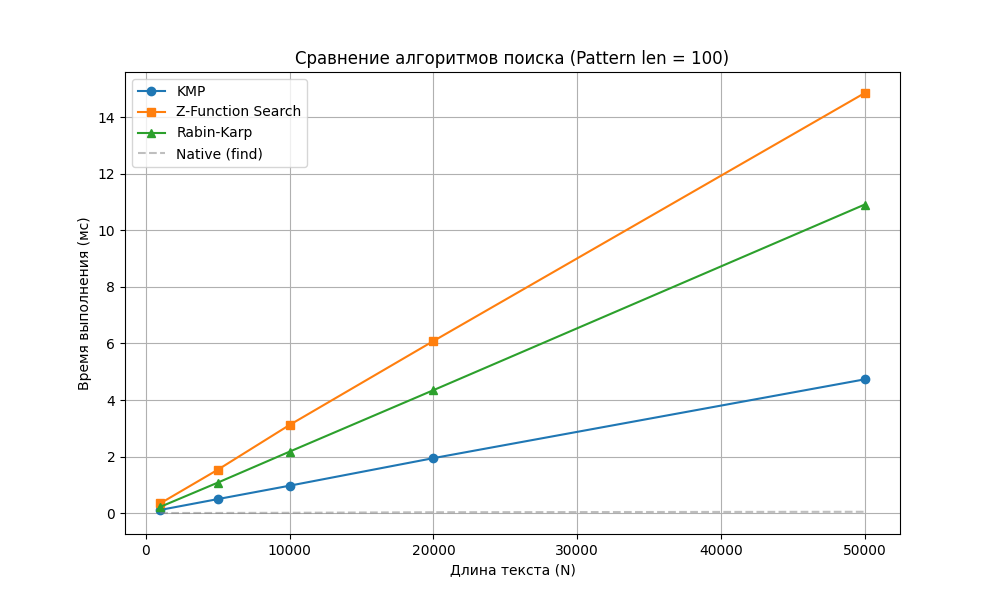

# Отчет по лабораторной работе №11
# Алгоритмы на строках

**Дата:** 13.12.2025
**Семестр:** 3 курс, 1 полугодие (5 семестр)
**Группа:** ПИЖ-23-1(2)
**Дисциплина:** Анализ сложности алгоритмов
**Студент:** Муртазов Руслан Равелевич

## Цель работы
Изучить специализированные алгоритмы для эффективной обработки строк. Освоить методы вычисления префикс-функции и Z-функции. Получить практические навыки реализации алгоритмов поиска подстрок (Кнута-Морриса-Пратта, Рабина-Карпа, поиск через Z-функцию) и провести сравнительный анализ их производительности.

## Теоретическая часть
- **Префикс-функция ($\pi[i]$):** Длина наибольшего собственного префикса подстроки $S[0 \dots i]$, который совпадает с её суффиксом. Вычисляется за $O(N)$.
- **Z-функция ($Z[i]$):** Длина наибольшего общего префикса строки $S$ и её суффикса, начинающегося с позиции $i$. Вычисляется за $O(N)$.
- **Алгоритм Кнута-Морриса-Пратта (KMP):** Использует префикс-функцию для определения величины сдвига паттерна при несовпадении символов, избегая повторных сравнений в тексте. Сложность $O(N+M)$.
- **Алгоритм Рабина-Карпа:** Использует скользящий хеш (Rolling Hash) для быстрого сравнения подстроки текста с паттерном. Эффективен для поиска нескольких паттернов, но в худшем случае работает за $O(N \cdot M)$.

## Практическая часть

### Выполненные задачи
1.  Реализовано вычисление **префикс-функции** и алгоритм **KMP**.
2.  Реализовано вычисление **Z-функции** и алгоритм поиска подстроки на её основе.
3.  Реализован алгоритм **Рабина-Карпа** с полиномиальным хешированием.
4.  Решена практическая задача проверки, является ли одна строка циклическим сдвигом другой.
5.  Написаны модульные тесты (`unittest`) для проверки корректности всех реализаций.
6.  Проведен эксперимент по сравнению времени работы алгоритмов на случайных данных.

### Ключевые фрагменты кода

```python
# 1. Вычисление префикс-функции
def compute_prefix_function(s: str) -> List[int]:
    n = len(s)
    pi = [0] * n
    for i in range(1, n):
        j = pi[i - 1]
        while j > 0 and s[i] != s[j]:
            j = pi[j - 1]
        if s[i] == s[j]:
            j += 1
        pi[i] = j
    return pi

# 2. Поиск через Z-функцию
def z_function_search(text: str, pattern: str) -> List[int]:
    if not pattern: return []
    # Конкатенация с разделителем
    concat = pattern + "#" + text
    z = compute_z_function(concat)
    matches = []
    p_len = len(pattern)
    # Проход по Z-массиву в области текста
    for i in range(p_len + 1, len(concat)):
        if z[i] == p_len:
            matches.append(i - p_len - 1)
    return matches

# 3. Проверка циклического сдвига
def is_cyclic_shift(s1: str, s2: str) -> bool:
    if len(s1) != len(s2):
        return False
    # s2 является циклическим сдвигом s1, 
    # если s2 содержится в удвоенной s1
    return len(kmp_search(s1 + s1, s2)) > 0
```

## Результаты выполнения

### Анализ производительности
Было проведено сравнение времени работы реализованных алгоритмов (KMP, Z-Search, Rabin-Karp) на случайных строках различной длины с фиксированным размером паттерна (100 символов).

**Наблюдения по графику:**
1.  **Линейная сложность:** Все три алгоритма (KMP, Z-Search, Rabin-Karp) демонстрируют линейный рост времени выполнения ($O(N)$) при увеличении длины текста, что соответствует теоретическим оценкам.
2.  **Сравнение эффективности:**
    - Алгоритмы **KMP** и **Z-Search** показывают схожую производительность, так как оба основаны на предварительном вычислении вспомогательных массивов за линейное время.
    - Алгоритм **Рабина-Карпа** работает чуть медленнее из-за накладных расходов на арифметические операции по модулю (вычисление хеша), хотя асимптотически он также эффективен в среднем случае.

## Ответы на контрольные вопросы

1.  **Что такое префикс-функция строки? Как она используется в алгоритме Кнута-Морриса-Пратта (KMP)?**
    Префикс-функция $\pi[i]$ — это длина максимального собственного префикса подстроки $S[0 \dots i]$, совпадающего с её суффиксом. В KMP она позволяет при несовпадении символа $Text[i]$ и $Pattern[j]$ не возвращаться назад по тексту, а сдвинуть индекс паттерна $j$ на позицию $\pi[j-1]$, зная, что предыдущая часть совпадает.

2.  **В чем основное преимущество алгоритма KMP перед наивным алгоритмом поиска подстроки?**
    Наивный алгоритм при несовпадении сдвигает паттерн всего на 1 позицию и заново сравнивает все символы, что в худшем случае (например, поиск `AAAB` в `AAAA...`) дает сложность $O(N \cdot M)$. KMP гарантирует сложность $O(N + M)$ благодаря использованию информации о структуре самого паттерна, исключая лишние сравнения.

3.  **Опишите, что такое Z-функция строки. Как с ее помощью можно решить задачу поиска подстроки?**
    $Z[i]$ — длина совпадения префикса всей строки $S$ с подстрокой, начинающейся в $i$. Для поиска паттерна $P$ в тексте $T$ создают строку $S = P + \# + T$. Если для какого-то $i$ в части текста $Z[i]$ равно длине паттерна $|P|$, значит, найдено вхождение.

4.  **В чем заключается идея алгоритма Бойера-Мура? Какие эвристики он использует для ускорения поиска?**
    Идея в том, чтобы сравнивать паттерн с текстом справа налево. Это позволяет при несовпадении сдвигать паттерн сразу на несколько позиций.
    Эвристики:
    - **Правило плохого символа:** Сдвиг паттерна так, чтобы несовпавший символ текста совпал с самым правым вхождением этого символа в паттерне.
    - **Правило хорошего суффикса:** Использование уже совпавшего суффикса для максимального безопасного сдвига.

5.  **Для каких практических задач, помимо поиска подстроки, могут применяться префикс- и Z-функции?**
    - Поиск периода строки (сжатие строк).
    - Проверка на циклический сдвиг.
    - Подсчет количества различных подстрок в строке.
    - Поиск палиндромов в строке (в модифицированном алгоритме Манакера).

## Приложения

### 1. График сравнения производительности
График подтверждает линейную зависимость времени выполнения от размера входных данных для всех реализованных алгоритмов.

